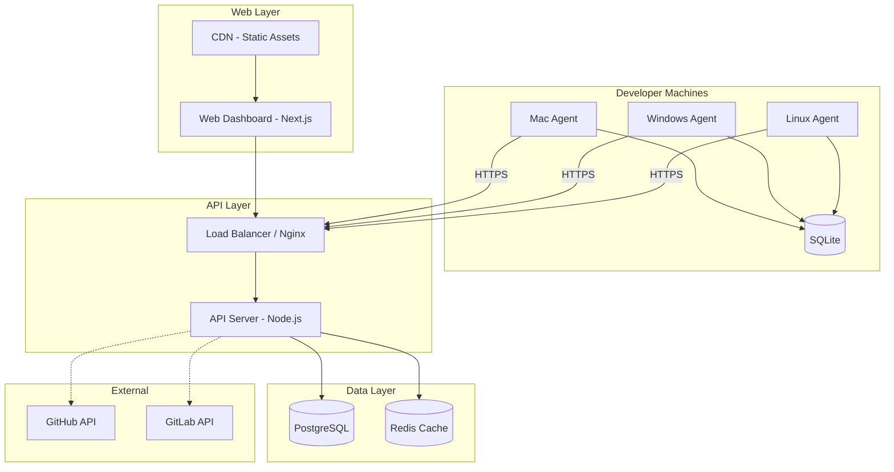
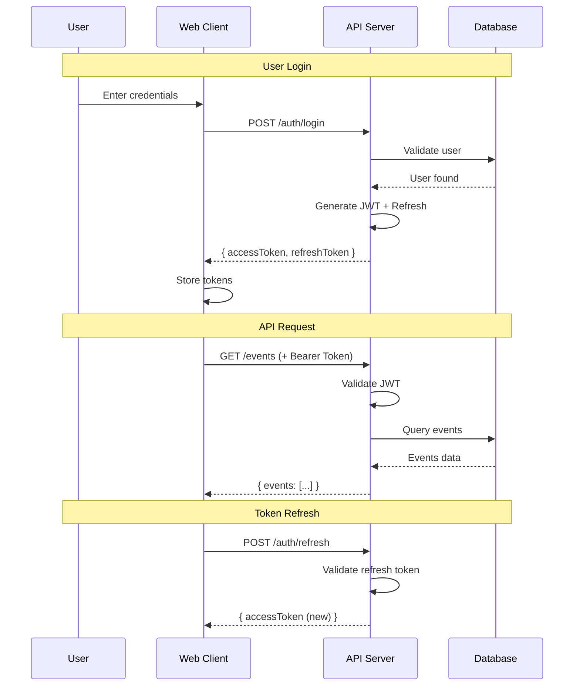
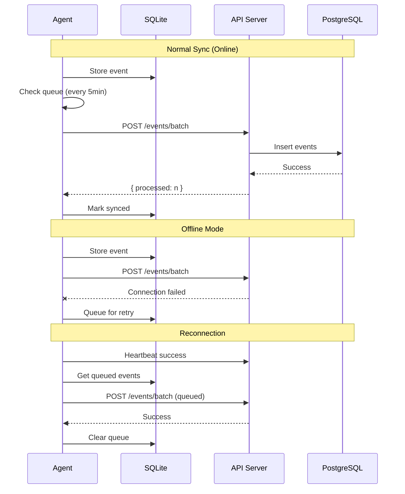

# TRD (기술 요구사항 정의서)

## Document Metadata

```yaml
doc_id: DOC-2
type: TRD
project_name: DevLog Hub
version: 1.0
last_updated: 2026-01-11
status: Draft
related_prd: DOC-1
```

---

## 1. System Architecture

### 1.1 High-Level Architecture



### 1.2 Component Responsibilities

| Component | Responsibility | Technology | Notes |
|-----------|----------------|------------|-------|
| Local Agent | 이벤트 수집, 로컬 저장, 동기화 | Go | 크로스 플랫폼 바이너리 |
| API Server | REST API, 인증, 비즈니스 로직 | Node.js + Express | TypeScript 사용 |
| Web Dashboard | UI, 검색, 시각화 | Next.js + React | SSR + CSR 하이브리드 |
| PostgreSQL | 영구 데이터 저장 | PostgreSQL 15+ | Full-text search 활용 |
| Redis | 세션, 캐시, Rate Limiting | Redis 7+ | 선택적 (MVP에서는 생략 가능) |
| SQLite | 로컬 에이전트 저장소 | SQLite 3 | 오프라인 지원 |

---

## 2. Technology Stack

### 2.1 Tech Stack Summary

```
┌─────────────────────────────────────────────────────────────┐
│                      DEVLOG HUB STACK                       │
├─────────────────────────────────────────────────────────────┤
│  LOCAL AGENT        │  Go 1.21+                             │
│                     │  SQLite3, fsnotify, go-git            │
├─────────────────────────────────────────────────────────────┤
│  BACKEND            │  Node.js 20 LTS + TypeScript          │
│                     │  Express.js, Prisma ORM               │
├─────────────────────────────────────────────────────────────┤
│  FRONTEND           │  Next.js 14 + React 18                │
│                     │  Tailwind CSS, shadcn/ui              │
├─────────────────────────────────────────────────────────────┤
│  DATABASE           │  PostgreSQL 15                        │
│                     │  SQLite (Local)                       │
├─────────────────────────────────────────────────────────────┤
│  INFRA              │  Docker, GitHub Actions               │
│                     │  Railway/Render (초기), AWS (확장)    │
└─────────────────────────────────────────────────────────────┘
```

### 2.2 Local Agent (Go)

| 항목 | 선택 | 선택 이유 | 대안 | 락인 리스크 |
|------|------|-----------|------|------------|
| Language | Go 1.21+ | 크로스 컴파일, 단일 바이너리, 경량 | Rust, Electron | Low |
| Local DB | SQLite3 | 설치 불필요, 파일 기반 | LevelDB | Low |
| File Watcher | fsnotify | 표준 라이브러리 수준 | OS-specific | Low |
| Git Parser | go-git | Pure Go, 외부 의존 없음 | libgit2 | Low |
| HTTP Client | net/http | 표준 라이브러리 | - | Low |

**Agent 스택 상세:**

```yaml
Language: Go 1.21+
Build: goreleaser (크로스 컴파일)
Dependencies:
  - mattn/go-sqlite3: SQLite 드라이버
  - fsnotify/fsnotify: 파일 시스템 감시
  - go-git/go-git: Git 저장소 파싱
  - spf13/cobra: CLI 프레임워크
  - robfig/cron: 스케줄러
Distribution: GitHub Releases (Windows/macOS/Linux)
```

### 2.3 Backend (Node.js)

| 항목 | 선택 | 선택 이유 | 대안 | 락인 리스크 |
|------|------|-----------|------|------------|
| Runtime | Node.js 20 LTS | 안정성, 생태계 | Bun, Deno | Low |
| Language | TypeScript 5 | 타입 안전성 | JavaScript | Low |
| Framework | Express.js | 간단, 성숙한 생태계 | Fastify, NestJS | Low |
| ORM | Prisma | TypeScript 친화적, 마이그레이션 | TypeORM, Drizzle | Medium |
| Validation | Zod | 스키마 정의 + 유효성 검사 | Joi, Yup | Low |
| Auth | JWT + bcrypt | 자체 구현, 단순 | Passport.js | Low |

**Backend 스택 상세:**

```yaml
Runtime: Node.js 20.x LTS
Language: TypeScript 5.x
Framework: Express.js 4.x
ORM: Prisma 5.x
Validation: Zod 3.x
Auth: jsonwebtoken + bcryptjs
API Docs: Swagger/OpenAPI 3.0
Testing: Vitest + Supertest
```

### 2.4 Frontend (Next.js)

| 항목 | 선택 | 선택 이유 | 대안 | 락인 리스크 |
|------|------|-----------|------|------------|
| Framework | Next.js 14 | SSR, 라우팅, 최적화 | Remix, Vite+React | Medium |
| UI Framework | React 18 | 생태계, 커뮤니티 | Vue, Svelte | Low |
| Styling | Tailwind CSS | 유틸리티 우선, 빠른 개발 | CSS Modules | Low |
| Components | shadcn/ui | 커스터마이징 가능, 접근성 | Radix UI | Low |
| State | Zustand | 간단, 경량 | Redux, Jotai | Low |
| Data Fetching | TanStack Query | 캐싱, 동기화 | SWR | Low |

**Frontend 스택 상세:**

```yaml
Framework: Next.js 14.x (App Router)
Language: TypeScript 5.x
Styling: Tailwind CSS 3.x
Components: shadcn/ui + Radix UI
Icons: Lucide React
Charts: Recharts
State: Zustand 4.x
Data: TanStack Query 5.x
Forms: React Hook Form + Zod
Testing: Vitest + Testing Library
```

### 2.5 Database

| 항목 | 선택 | 선택 이유 | 대안 | 락인 리스크 |
|------|------|-----------|------|------------|
| Primary DB | PostgreSQL 15 | 무료, 강력한 검색, JSON 지원 | MySQL | Low |
| Local DB | SQLite 3 | 설치 불필요, 오프라인 | - | Low |
| Cache | Redis (선택) | 세션, Rate Limit | In-memory | Low |
| Search | PostgreSQL FTS | 별도 서비스 불필요 | Elasticsearch | Low |

### 2.6 Deployment & Hosting

| 항목 | MVP 선택 | 확장 시 선택 | 예상 비용 (월) |
|------|----------|--------------|----------------|
| Cloud Provider | Railway/Render | AWS/GCP | $0-20 → $50-200 |
| Container | Docker | Kubernetes | Included |
| CI/CD | GitHub Actions | GitHub Actions | Free tier |
| CDN | Vercel | CloudFront | Free tier |
| Domain | Cloudflare | Cloudflare | $10/year |

**비용 추정:**

```
MVP Phase (1-5 users):
- Railway Hobby: $5/month
- PostgreSQL (Railway): Included
- Vercel Free: $0
- Total: ~$5-10/month

Growth Phase (5-50 users):
- Railway Pro: $20/month
- PostgreSQL Pro: $15/month
- Vercel Pro: $20/month
- Total: ~$55/month

Scale Phase (50-500 users):
- AWS ECS: $50-100/month
- RDS PostgreSQL: $30-50/month
- CloudFront: $10-20/month
- Total: ~$100-200/month
```

---

## 3. Non-Functional Requirements

### 3.1 Performance

| Metric | Requirement | Measurement |
|--------|-------------|-------------|
| Dashboard Load | < 2s (LCP) | Core Web Vitals |
| API Response (P95) | < 300ms | APM |
| Search Response | < 1s (1만 건 기준) | Query Analysis |
| Sync Batch | < 5s (100 이벤트) | Load Test |
| Agent CPU Usage | < 2% (idle) | System Monitor |
| Agent Memory | < 50MB | System Monitor |

### 3.2 Security

| Category | Requirement | Implementation |
|----------|-------------|----------------|
| Transport | HTTPS Only | TLS 1.3, HSTS |
| Authentication | JWT + Refresh Token | Access: 15min, Refresh: 7days |
| Password | bcrypt (cost 12) | 최소 8자, 복잡도 검증 |
| API Auth | Bearer Token | Agent: API Key, User: JWT |
| Secrets | 환경 변수 | dotenv, Railway Secrets |

**Security Checklist:**

```
[x] HTTPS 전용 통신
[x] SQL Injection 방지 (Prisma ORM)
[x] XSS 방지 (React 기본)
[x] CSRF 토큰 (sameSite cookie)
[x] Rate Limiting (express-rate-limit)
[x] Input Validation (Zod)
[x] Secrets Management (환경 변수)
[ ] 2FA (v2에서 구현)
```

### 3.3 Scalability

| Dimension | MVP | Target (1년) | Strategy |
|-----------|-----|--------------|----------|
| Users | 1-5 | 50-100 | Vertical scaling |
| Events/day | 1,000 | 100,000 | 배치 처리, 인덱싱 |
| Storage | 1GB | 50GB | PostgreSQL 파티셔닝 |
| Agents | 5 | 100 | 동시 연결 최적화 |

### 3.4 Availability

| Metric | Target | Strategy |
|--------|--------|----------|
| Uptime | 99.5% | Health check, 자동 재시작 |
| RTO | 4 hours | Docker 재배포 |
| RPO | 1 hour | 자동 백업 |

---

## 4. API Design

### 4.1 API Principles

```yaml
Style: REST
Base URL: /api/v1
Versioning: URL path (/v1/)
Auth: Bearer Token (JWT / API Key)
Rate Limit: 100 req/min (user), 1000 req/min (agent)
Pagination: Cursor-based (for events), Offset (for lists)
Response: JSON, camelCase
Errors: RFC 7807 Problem Details
```

### 4.2 Core Endpoints

**Authentication:**

| Method | Endpoint | Description |
|--------|----------|-------------|
| POST | /auth/register | 회원가입 |
| POST | /auth/login | 로그인 |
| POST | /auth/refresh | 토큰 갱신 |
| POST | /auth/logout | 로그아웃 |

**Agents:**

| Method | Endpoint | Description |
|--------|----------|-------------|
| GET | /agents | 에이전트 목록 |
| POST | /agents | 에이전트 등록 |
| GET | /agents/:id | 에이전트 상세 |
| PATCH | /agents/:id | 에이전트 수정 |
| DELETE | /agents/:id | 에이전트 삭제 |
| POST | /agents/:id/heartbeat | 상태 업데이트 |

**Events:**

| Method | Endpoint | Description |
|--------|----------|-------------|
| GET | /events | 이벤트 목록 (검색/필터) |
| POST | /events/batch | 이벤트 배치 등록 |
| GET | /events/:id | 이벤트 상세 |
| GET | /events/timeline | 타임라인 뷰 |
| GET | /events/stats | 통계 데이터 |

**Projects:**

| Method | Endpoint | Description |
|--------|----------|-------------|
| GET | /projects | 프로젝트 목록 |
| POST | /projects | 프로젝트 생성 |
| GET | /projects/:id | 프로젝트 상세 |
| PATCH | /projects/:id | 프로젝트 수정 |
| DELETE | /projects/:id | 프로젝트 삭제 |
| GET | /projects/:id/events | 프로젝트 이벤트 |

**Search:**

| Method | Endpoint | Description |
|--------|----------|-------------|
| GET | /search | 전문 검색 |
| GET | /search/suggestions | 검색 자동완성 |

### 4.3 Request/Response Examples

**Event Batch Upload (Agent → Server):**

```json
// POST /api/v1/events/batch
// Headers: Authorization: Bearer <agent_api_token>

// Request
{
  "events": [
    {
      "eventType": "git",
      "eventAction": "commit",
      "title": "feat: Add user authentication",
      "content": "Implemented JWT-based auth flow",
      "metadata": {
        "commitHash": "abc123",
        "branch": "feature/auth",
        "filesChanged": 5,
        "insertions": 120,
        "deletions": 15
      },
      "localTimestamp": "2026-01-11T14:32:00Z"
    }
  ]
}

// Response (201 Created)
{
  "success": true,
  "data": {
    "processed": 1,
    "failed": 0,
    "eventIds": ["uuid-1"]
  }
}
```

**Event Search:**

```json
// GET /api/v1/events?q=authentication&type=git&from=2026-01-01

// Response
{
  "success": true,
  "data": {
    "events": [...],
    "pagination": {
      "cursor": "eyJpZCI6IjEyMyJ9",
      "hasMore": true
    }
  }
}
```

---

## 5. Access Control

### 5.1 Role Definitions

| Role | Description | Scope |
|------|-------------|-------|
| owner | 프로젝트 소유자 | 프로젝트 CRUD, 멤버 관리 |
| admin | 관리자 | 프로젝트 RU, 멤버 관리 |
| member | 일반 멤버 | 이벤트 CRUD, 프로젝트 R |
| viewer | 읽기 전용 | 이벤트 R, 프로젝트 R |

### 5.2 Permission Matrix

```
| Resource        | Owner | Admin | Member | Viewer |
|-----------------|-------|-------|--------|--------|
| /projects       | CRUD  | RU    | R      | R      |
| /projects/members| CRUD | CRUD  | R      | R      |
| /events         | CRUD  | CRUD  | CRUD   | R      |
| /notes          | CRUD  | CRUD  | CRUD   | R      |
| /reports        | CRUD  | CRUD  | CR     | R      |
| /agents         | CRUD  | CRUD  | CRUD   | -      |
```

### 5.3 Authentication Flow



---

## 6. Agent-Server Sync Protocol

### 6.1 Sync Flow



### 6.2 Conflict Resolution

```yaml
Strategy: Last-Write-Wins (Server Time)
Duplicate Detection: (agent_id, local_timestamp, event_type, title)
Conflict Handling:
  - Same event from same agent: Skip (idempotent)
  - Different agents: Both stored (no conflict)
  - Clock skew: Server timestamp authoritative
```

---

## 7. Observability

### 7.1 Logging

| Level | Usage | Example |
|-------|-------|---------|
| ERROR | 예외, 실패 | "Failed to sync events: connection timeout" |
| WARN | 비정상 상황 | "Agent offline for 1 hour" |
| INFO | 주요 동작 | "User logged in: user@email.com" |
| DEBUG | 개발용 상세 | "Query executed: SELECT * FROM events..." |

**Log Format:**

```json
{
  "timestamp": "2026-01-11T14:32:00.000Z",
  "level": "INFO",
  "service": "api",
  "message": "Event batch received",
  "context": {
    "agentId": "uuid",
    "eventCount": 15,
    "duration": 45
  }
}
```

### 7.2 Metrics

| Metric | Type | Alert Threshold |
|--------|------|-----------------|
| api_request_duration_ms | Histogram | P95 > 500ms |
| api_error_rate | Counter | > 1% |
| agent_sync_success_rate | Gauge | < 95% |
| db_connection_pool | Gauge | > 80% used |
| events_per_minute | Counter | > 1000 (capacity) |

### 7.3 Health Checks

```yaml
Endpoints:
  - GET /health: Basic liveness
  - GET /health/ready: Full readiness (DB, Redis)

Response:
  {
    "status": "healthy",
    "timestamp": "2026-01-11T14:32:00Z",
    "checks": {
      "database": "ok",
      "redis": "ok"
    }
  }
```

---

## 8. Development Environment

### 8.1 Local Setup

```bash
# Prerequisites
- Go 1.21+
- Node.js 20+
- PostgreSQL 15+
- Docker (optional)

# Directory Structure
devlog-hub/
├── agent/           # Go agent
├── server/          # Node.js API
├── web/             # Next.js frontend
├── docker/          # Docker configs
├── docs/            # Documentation
└── scripts/         # Utility scripts
```

### 8.2 Docker Compose (Development)

```yaml
services:
  postgres:
    image: postgres:15
    ports:
      - "5432:5432"
    environment:
      POSTGRES_DB: devloghub
      POSTGRES_USER: devlog
      POSTGRES_PASSWORD: devlog123

  redis:
    image: redis:7
    ports:
      - "6379:6379"

  api:
    build: ./server
    ports:
      - "3001:3001"
    depends_on:
      - postgres
      - redis

  web:
    build: ./web
    ports:
      - "3000:3000"
    depends_on:
      - api
```

---

## 9. Validation Checklist

```
[TRD 검증]
- [x] 시스템 아키텍처 정의
- [x] 기술 스택 선정 및 근거
- [x] 성능 요구사항 정의
- [x] 보안 요구사항 정의
- [x] API 설계 완료
- [x] 인증/인가 모델 정의
- [x] 동기화 프로토콜 정의
- [x] 모니터링 전략 수립
- [x] 개발 환경 구성 정의
- [x] 비용 추정
```

---

## Document References

| 참조 문서 | 관련 섹션 |
|-----------|-----------|
| DOC-1 (PRD) | FEAT-x 기능 요구사항 |
| DOC-4 (Database) | 스키마 상세 설계 |
| DOC-6 (TASKS) | 개발 마일스톤 |
| DOC-7 (Convention) | 코딩 표준 |

---

## Revision History

| Version | Date | Author | Changes |
|---------|------|--------|---------|
| 1.0 | 2026-01-11 | Claude + User | Initial draft |
