# User Flow (사용자 흐름도)

## Document Metadata

```yaml
doc_id: DOC-3
type: User Flow
project_name: DevLog Hub
version: 1.0
last_updated: 2026-01-11
related_features: FEAT-1, FEAT-2, FEAT-3, FEAT-4, FEAT-5, FEAT-6
```

---

## 1. System Overview Flow

### 1.1 전체 시스템 흐름

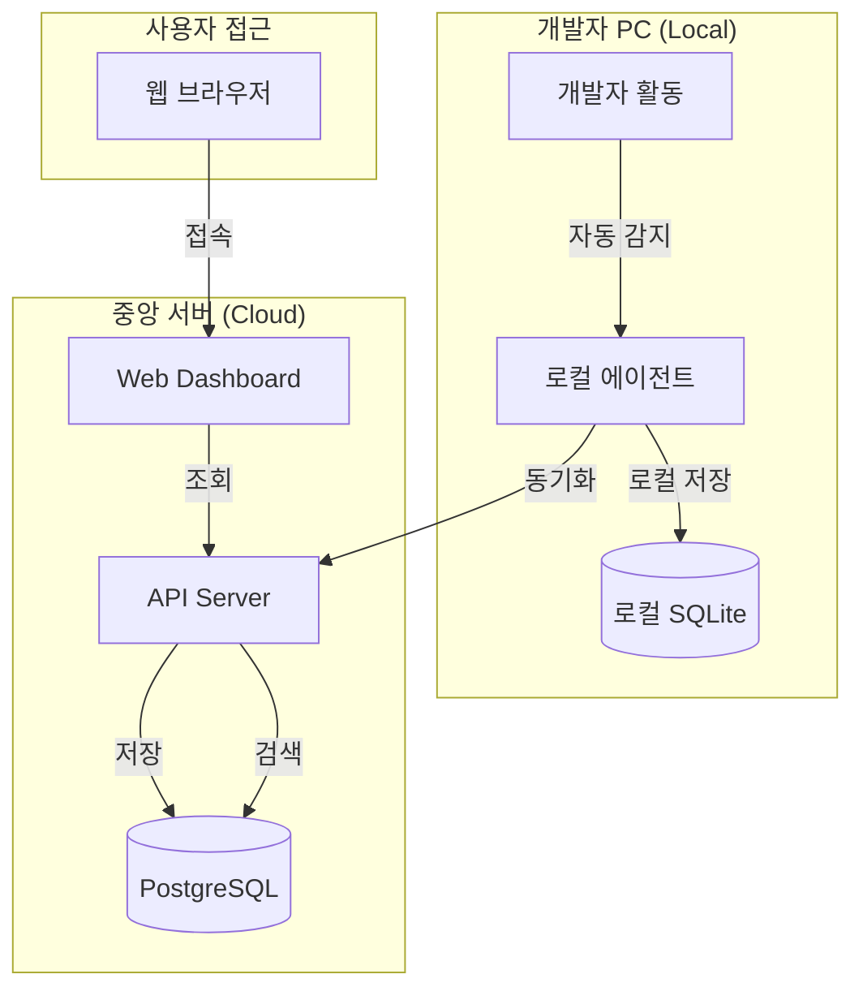

---

## 2. User Journey Flows

### 2.1 Phase 1: Onboarding (첫 경험)

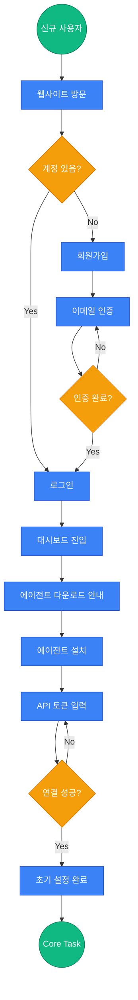

### 2.2 Phase 2: Core Task (핵심 작업)

#### FEAT-1: 자동 로그 수집 흐름

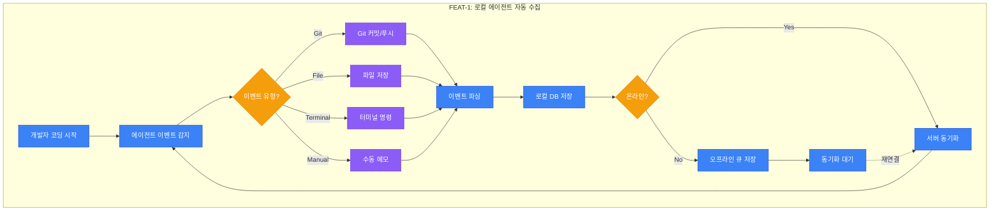

#### FEAT-2: 검색 시스템 흐름

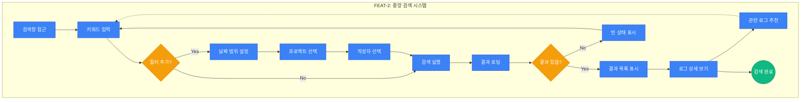

#### FEAT-3: 대시보드 흐름

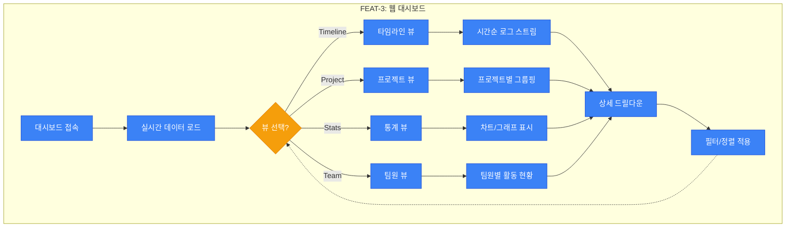

#### FEAT-4: 프로젝트 그룹핑 흐름

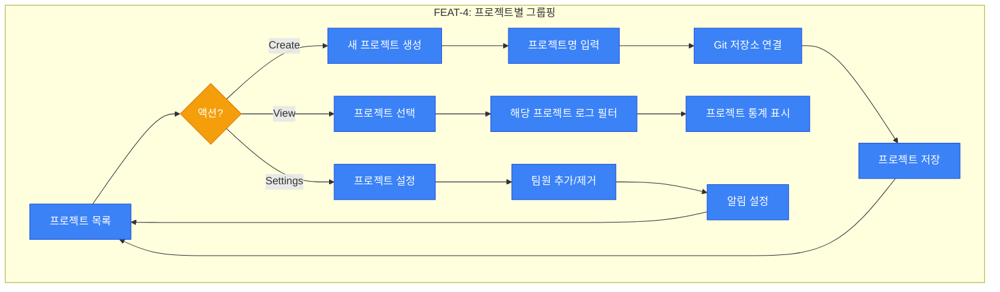

#### FEAT-5: 리포트 생성 흐름

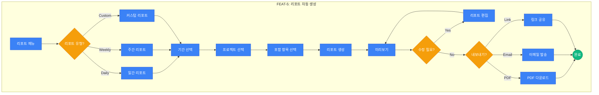

#### FEAT-6: 수동 메모 흐름

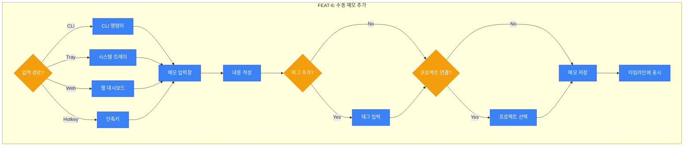

### 2.3 Phase 3: Retention (리텐션)

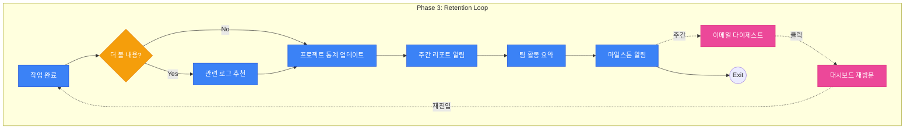

---

## 3. Error Handling Flows

### 3.1 동기화 실패 처리

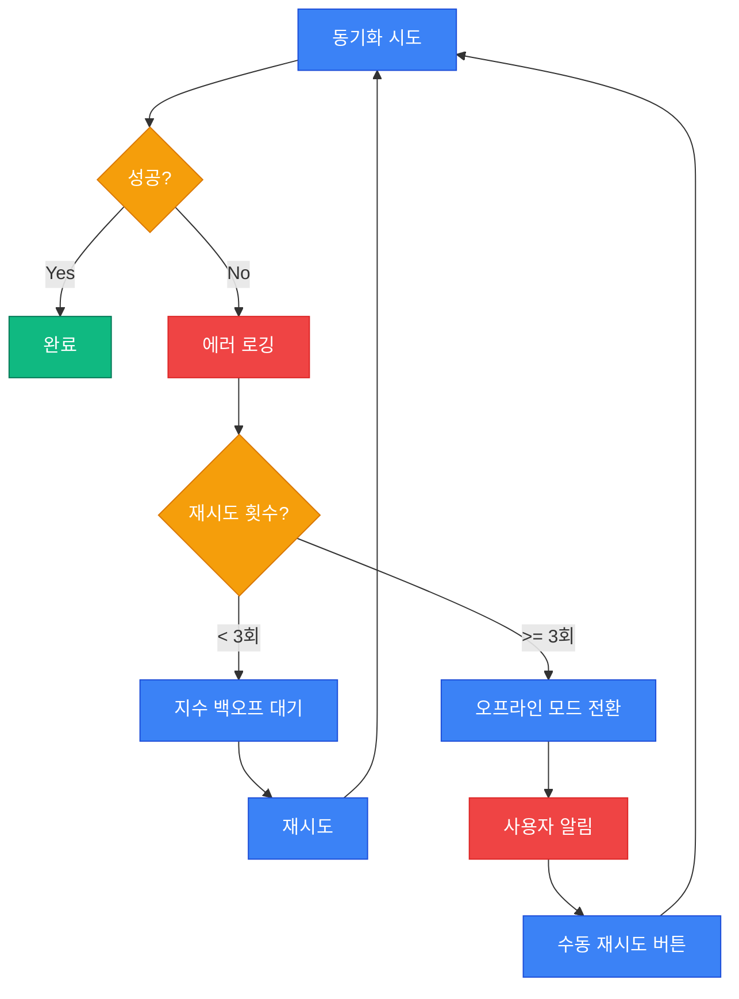

### 3.2 인증 만료 처리

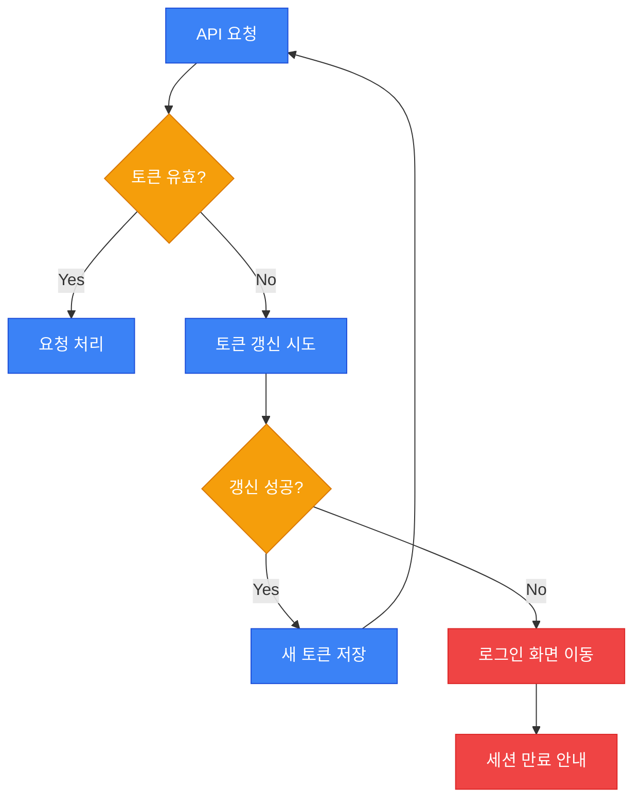

---

## 4. Role-Based Flows

### 4.1 개발자 (USER-1) 주요 경로

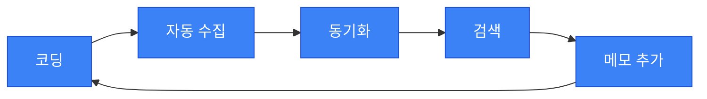

### 4.2 팀 리드 (USER-2) 주요 경로


### 4.3 신규 합류자 (USER-3) 주요 경로


---

## 5. Validation Checklist

```
[User Flow 검증]
- [x] FEAT-1 (자동 수집) 흐름도 완성
- [x] FEAT-2 (검색) 흐름도 완성
- [x] FEAT-3 (대시보드) 흐름도 완성
- [x] FEAT-4 (그룹핑) 흐름도 완성
- [x] FEAT-5 (리포트) 흐름도 완성
- [x] FEAT-6 (메모) 흐름도 완성
- [x] 모든 결정 노드에 Yes/No 분기 존재
- [x] Onboarding -> Core -> Retention 구조 준수
- [x] 실패 경로에서 복구/재시도 가능
- [x] Retention Loop 표현됨
- [x] Mermaid 문법 검증
```

---

## Document References

| 참조 문서 | 관련 섹션 |
|-----------|-----------|
| DOC-1 (PRD) | FEAT-1 ~ FEAT-6 User Stories |
| DOC-4 (Database) | 이벤트 테이블 스키마 |
| DOC-6 (TASKS) | M2, M3, M4 마일스톤 |

---

## Revision History

| Version | Date | Author | Changes |
|---------|------|--------|---------|
| 1.0 | 2026-01-11 | Claude + User | Initial draft |
