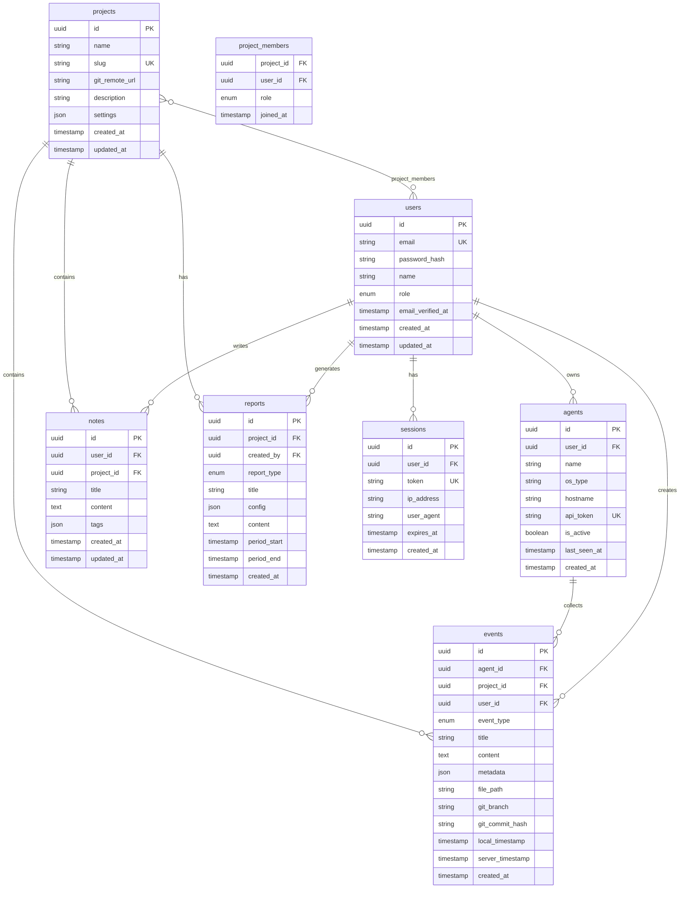
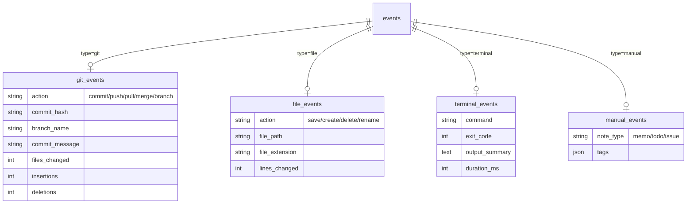

# Database Design (데이터베이스 설계)

## Document Metadata

```yaml
doc_id: DOC-4
type: Database Design
project_name: DevLog Hub
version: 1.0
last_updated: 2026-01-11
db_type: PostgreSQL (Server) + SQLite (Local Agent)
related_features: FEAT-1, FEAT-2, FEAT-3, FEAT-4, FEAT-5, FEAT-6
```

---

## 1. Entity Identification

### 1.1 Core Entities from FEAT-x

| FEAT | Entity | Description | Cardinality |
|------|--------|-------------|-------------|
| FEAT-1 | events | 개발 활동 이벤트 (커밋, 파일 저장 등) | User 1:N Events |
| FEAT-2 | - | events 테이블 검색 활용 | - |
| FEAT-3 | - | events 집계/통계 활용 | - |
| FEAT-4 | projects | 프로젝트/저장소 그룹 | User M:N Projects |
| FEAT-5 | reports | 생성된 리포트 | Project 1:N Reports |
| FEAT-6 | notes | 수동 메모/노트 | User 1:N Notes |

### 1.2 System Entities

| Entity | Purpose | Required |
|--------|---------|----------|
| users | 사용자 관리 | Yes |
| agents | 로컬 에이전트 등록/관리 | Yes |
| sessions | 세션 관리 | Yes |
| sync_queue | 동기화 대기열 (로컬) | Yes |
| audit_logs | 감사 로그 | Optional (v2) |

---

## 2. ERD (Entity Relationship Diagram)

### 2.1 Main ERD



### 2.2 Event Types Hierarchy



---

## 3. Schema Design

### 3.1 Table Specifications

#### users

```sql
-- FEAT-1, FEAT-3 관련: 사용자 관리
CREATE TABLE users (
    id              UUID PRIMARY KEY DEFAULT gen_random_uuid(),
    email           VARCHAR(255) NOT NULL UNIQUE,
    password_hash   VARCHAR(255) NOT NULL,
    name            VARCHAR(100) NOT NULL,
    role            VARCHAR(20) DEFAULT 'user'
                    CHECK (role IN ('admin', 'member', 'viewer')),
    avatar_url      VARCHAR(500),
    email_verified_at TIMESTAMP,
    created_at      TIMESTAMP DEFAULT CURRENT_TIMESTAMP,
    updated_at      TIMESTAMP DEFAULT CURRENT_TIMESTAMP,
    deleted_at      TIMESTAMP -- Soft delete
);

-- Indexes
CREATE INDEX idx_users_email ON users(email);
CREATE INDEX idx_users_role ON users(role);
CREATE INDEX idx_users_created ON users(created_at);
```

#### agents

```sql
-- FEAT-1 관련: 로컬 에이전트 관리
CREATE TABLE agents (
    id              UUID PRIMARY KEY DEFAULT gen_random_uuid(),
    user_id         UUID NOT NULL REFERENCES users(id) ON DELETE CASCADE,
    name            VARCHAR(100) NOT NULL,
    os_type         VARCHAR(20) NOT NULL
                    CHECK (os_type IN ('windows', 'macos', 'linux')),
    hostname        VARCHAR(255),
    api_token       VARCHAR(64) NOT NULL UNIQUE,
    is_active       BOOLEAN DEFAULT true,
    last_seen_at    TIMESTAMP,
    created_at      TIMESTAMP DEFAULT CURRENT_TIMESTAMP,

    UNIQUE(user_id, hostname)
);

-- Indexes
CREATE INDEX idx_agents_user ON agents(user_id);
CREATE INDEX idx_agents_token ON agents(api_token);
CREATE INDEX idx_agents_active ON agents(is_active) WHERE is_active = true;
```

#### projects

```sql
-- FEAT-4 관련: 프로젝트 그룹핑
CREATE TABLE projects (
    id              UUID PRIMARY KEY DEFAULT gen_random_uuid(),
    name            VARCHAR(200) NOT NULL,
    slug            VARCHAR(250) NOT NULL UNIQUE,
    git_remote_url  VARCHAR(500),
    description     TEXT,
    settings        JSONB DEFAULT '{}',
    created_at      TIMESTAMP DEFAULT CURRENT_TIMESTAMP,
    updated_at      TIMESTAMP DEFAULT CURRENT_TIMESTAMP,
    deleted_at      TIMESTAMP
);

-- Indexes
CREATE INDEX idx_projects_slug ON projects(slug);
CREATE INDEX idx_projects_git ON projects(git_remote_url);
```

#### project_members

```sql
-- FEAT-4 관련: 프로젝트 멤버십
CREATE TABLE project_members (
    project_id      UUID NOT NULL REFERENCES projects(id) ON DELETE CASCADE,
    user_id         UUID NOT NULL REFERENCES users(id) ON DELETE CASCADE,
    role            VARCHAR(20) DEFAULT 'member'
                    CHECK (role IN ('owner', 'admin', 'member', 'viewer')),
    joined_at       TIMESTAMP DEFAULT CURRENT_TIMESTAMP,

    PRIMARY KEY (project_id, user_id)
);

-- Indexes
CREATE INDEX idx_pm_user ON project_members(user_id);
CREATE INDEX idx_pm_project ON project_members(project_id);
```

#### events (핵심 테이블)

```sql
-- FEAT-1, FEAT-2, FEAT-3 관련: 이벤트 로그 저장
CREATE TABLE events (
    id                  UUID PRIMARY KEY DEFAULT gen_random_uuid(),
    agent_id            UUID NOT NULL REFERENCES agents(id),
    project_id          UUID REFERENCES projects(id),
    user_id             UUID NOT NULL REFERENCES users(id),

    -- Event Classification
    event_type          VARCHAR(30) NOT NULL
                        CHECK (event_type IN ('git', 'file', 'terminal', 'manual')),
    event_action        VARCHAR(30) NOT NULL, -- commit, save, exec, memo

    -- Content
    title               VARCHAR(500),
    content             TEXT,
    metadata            JSONB DEFAULT '{}',

    -- Context
    file_path           VARCHAR(1000),
    git_branch          VARCHAR(200),
    git_commit_hash     VARCHAR(40),

    -- Timestamps
    local_timestamp     TIMESTAMP NOT NULL, -- 로컬에서 발생한 시간
    server_timestamp    TIMESTAMP DEFAULT CURRENT_TIMESTAMP, -- 서버 수신 시간
    created_at          TIMESTAMP DEFAULT CURRENT_TIMESTAMP
);

-- Indexes (검색 최적화)
CREATE INDEX idx_events_user ON events(user_id);
CREATE INDEX idx_events_agent ON events(agent_id);
CREATE INDEX idx_events_project ON events(project_id);
CREATE INDEX idx_events_type ON events(event_type);
CREATE INDEX idx_events_action ON events(event_action);
CREATE INDEX idx_events_local_ts ON events(local_timestamp DESC);
CREATE INDEX idx_events_server_ts ON events(server_timestamp DESC);

-- Full-text search index
CREATE INDEX idx_events_content_fts ON events
    USING GIN (to_tsvector('english', coalesce(title, '') || ' ' || coalesce(content, '')));

-- Composite index for common queries
CREATE INDEX idx_events_user_project_ts ON events(user_id, project_id, local_timestamp DESC);
```

#### notes

```sql
-- FEAT-6 관련: 수동 메모
CREATE TABLE notes (
    id              UUID PRIMARY KEY DEFAULT gen_random_uuid(),
    user_id         UUID NOT NULL REFERENCES users(id) ON DELETE CASCADE,
    project_id      UUID REFERENCES projects(id),
    event_id        UUID REFERENCES events(id), -- 연결된 이벤트

    title           VARCHAR(300),
    content         TEXT NOT NULL,
    tags            JSONB DEFAULT '[]',

    created_at      TIMESTAMP DEFAULT CURRENT_TIMESTAMP,
    updated_at      TIMESTAMP DEFAULT CURRENT_TIMESTAMP,
    deleted_at      TIMESTAMP
);

-- Indexes
CREATE INDEX idx_notes_user ON notes(user_id);
CREATE INDEX idx_notes_project ON notes(project_id);
CREATE INDEX idx_notes_tags ON notes USING GIN (tags);
CREATE INDEX idx_notes_created ON notes(created_at DESC);
```

#### reports

```sql
-- FEAT-5 관련: 리포트 저장
CREATE TABLE reports (
    id              UUID PRIMARY KEY DEFAULT gen_random_uuid(),
    project_id      UUID REFERENCES projects(id),
    created_by      UUID NOT NULL REFERENCES users(id),

    report_type     VARCHAR(30) NOT NULL
                    CHECK (report_type IN ('daily', 'weekly', 'monthly', 'custom')),
    title           VARCHAR(300) NOT NULL,
    config          JSONB DEFAULT '{}', -- 리포트 설정
    content         TEXT, -- 렌더링된 리포트

    period_start    TIMESTAMP,
    period_end      TIMESTAMP,

    created_at      TIMESTAMP DEFAULT CURRENT_TIMESTAMP
);

-- Indexes
CREATE INDEX idx_reports_project ON reports(project_id);
CREATE INDEX idx_reports_user ON reports(created_by);
CREATE INDEX idx_reports_type ON reports(report_type);
CREATE INDEX idx_reports_period ON reports(period_start, period_end);
```

#### sessions

```sql
-- 세션 관리
CREATE TABLE sessions (
    id              UUID PRIMARY KEY DEFAULT gen_random_uuid(),
    user_id         UUID NOT NULL REFERENCES users(id) ON DELETE CASCADE,
    token           VARCHAR(64) NOT NULL UNIQUE,
    ip_address      INET,
    user_agent      TEXT,
    expires_at      TIMESTAMP NOT NULL,
    created_at      TIMESTAMP DEFAULT CURRENT_TIMESTAMP
);

-- Indexes
CREATE INDEX idx_sessions_token ON sessions(token);
CREATE INDEX idx_sessions_user ON sessions(user_id);
CREATE INDEX idx_sessions_expires ON sessions(expires_at);
```

### 3.2 Local SQLite Schema (Agent)

```sql
-- 로컬 에이전트용 SQLite 스키마

-- 동기화 대기열
CREATE TABLE sync_queue (
    id              INTEGER PRIMARY KEY AUTOINCREMENT,
    event_data      TEXT NOT NULL, -- JSON
    local_timestamp DATETIME NOT NULL,
    sync_status     TEXT DEFAULT 'pending'
                    CHECK (sync_status IN ('pending', 'syncing', 'synced', 'failed')),
    retry_count     INTEGER DEFAULT 0,
    error_message   TEXT,
    created_at      DATETIME DEFAULT CURRENT_TIMESTAMP
);

-- 로컬 설정
CREATE TABLE local_config (
    key             TEXT PRIMARY KEY,
    value           TEXT NOT NULL,
    updated_at      DATETIME DEFAULT CURRENT_TIMESTAMP
);

-- 프로젝트 매핑 (로컬 경로 -> 서버 프로젝트)
CREATE TABLE project_mappings (
    local_path      TEXT PRIMARY KEY,
    project_id      TEXT NOT NULL,
    project_name    TEXT,
    updated_at      DATETIME DEFAULT CURRENT_TIMESTAMP
);

-- Indexes
CREATE INDEX idx_sync_status ON sync_queue(sync_status);
CREATE INDEX idx_sync_created ON sync_queue(created_at);
```

### 3.3 Naming Conventions

```
[명명 규칙]

Tables:
- 복수형 소문자 (users, events, projects)
- 연결 테이블: {table1}_{table2} (project_members)

Columns:
- snake_case (created_at, user_id)
- 외래키: {단수테이블명}_id (user_id, project_id)
- Boolean: is_, has_ prefix (is_active, has_verified)
- 날짜: _at suffix (created_at, synced_at)
- JSON: 복수형 또는 설명적 이름 (tags, metadata, settings)

Indexes:
- idx_{table}_{column} (idx_users_email)
- idx_{table}_{column1}_{column2} for composite
```

---

## 4. Indexing Strategy

### 4.1 Index Types Used

| Index Type | Use Case | Example |
|------------|----------|---------|
| B-Tree | 범위 검색, 정렬, 일반 조회 | local_timestamp |
| Hash | 동등 비교 (Unique) | api_token |
| GIN | JSON, Full-text Search | metadata, content FTS |
| Composite | 다중 컬럼 검색 | (user_id, project_id, timestamp) |

### 4.2 Query-Based Index Plan

| Query Pattern | Table | Index | Type |
|---------------|-------|-------|------|
| 사용자별 이벤트 조회 | events | (user_id, local_timestamp DESC) | Composite |
| 프로젝트별 이벤트 조회 | events | (project_id, local_timestamp DESC) | Composite |
| 키워드 검색 | events | GIN on title + content | Full-text |
| 이벤트 유형 필터 | events | event_type | B-Tree |
| 최근 이벤트 | events | local_timestamp DESC | B-Tree |
| 에이전트 토큰 인증 | agents | api_token | Unique |
| 활성 에이전트 조회 | agents | is_active (partial) | Partial |

### 4.3 Query Optimization Notes

```
[핵심 쿼리 최적화]

1. 타임라인 조회 (가장 빈번)
   - events(user_id, local_timestamp DESC) 복합 인덱스
   - LIMIT + OFFSET 대신 cursor-based pagination

2. 전문 검색
   - PostgreSQL tsvector + GIN 인덱스
   - 한글 검색: pg_trgm extension 활용

3. 통계 집계
   - 시간별 집계: date_trunc 함수 + 인덱스
   - 캐싱: 자주 조회되는 통계는 별도 테이블

4. 동기화 처리
   - 배치 INSERT: COPY 또는 multi-row INSERT
   - 충돌 해결: ON CONFLICT DO UPDATE
```

---

## 5. Data Flow

### 5.1 Event Collection Flow

```
[로컬 에이전트]                  [중앙 서버]
     │                              │
     │  1. 이벤트 감지              │
     ▼                              │
┌─────────┐                         │
│ 파싱 및  │                         │
│ 분류    │                         │
└────┬────┘                         │
     │                              │
     │  2. 로컬 저장                │
     ▼                              │
┌─────────┐                         │
│ SQLite  │                         │
│sync_queue│                        │
└────┬────┘                         │
     │                              │
     │  3. 배치 동기화 (5분)        │
     ├─────────────────────────────►│
     │       POST /api/events/batch │
     │                              ▼
     │                       ┌─────────┐
     │                       │PostgreSQL│
     │                       │ events  │
     │                       └─────────┘
```

### 5.2 Search Flow

```
[웹 대시보드]                 [API 서버]              [PostgreSQL]
     │                           │                       │
     │  GET /api/search?q=auth   │                       │
     ├──────────────────────────►│                       │
     │                           │  Full-text Search     │
     │                           ├──────────────────────►│
     │                           │                       │
     │                           │◄──────────────────────┤
     │                           │  Results              │
     │◄──────────────────────────┤                       │
     │  JSON Response            │                       │
```

---

## 6. FEAT-x to Table Mapping

| FEAT | Primary Table | Related Tables | Key Queries |
|------|---------------|----------------|-------------|
| FEAT-1 | events | agents, sync_queue | INSERT batch, agent auth |
| FEAT-2 | events | - | Full-text search, filter |
| FEAT-3 | events | projects, users | Aggregation, timeline |
| FEAT-4 | projects | project_members, events | CRUD, membership |
| FEAT-5 | reports | events, projects | Date range aggregation |
| FEAT-6 | notes | events, projects | CRUD, tag search |

---

## 7. Migration Strategy

### 7.1 Migration File Naming

```
{timestamp}_{action}_{table}.sql

예:
20260111_001_create_users.sql
20260111_002_create_agents.sql
20260111_003_create_projects.sql
20260111_004_create_events.sql
20260111_005_create_notes.sql
20260111_006_create_reports.sql
20260111_007_add_fts_indexes.sql
```

### 7.2 Initial Migration Order

```
1. users (독립)
2. sessions (users 의존)
3. agents (users 의존)
4. projects (독립)
5. project_members (users, projects 의존)
6. events (agents, projects, users 의존)
7. notes (users, projects, events 의존)
8. reports (users, projects 의존)
```

---

## 8. Validation Checklist

```
[DB 설계 검증]
- [x] FEAT-1 (자동 수집): events, agents, sync_queue 테이블
- [x] FEAT-2 (검색): events FTS 인덱스
- [x] FEAT-3 (대시보드): events 집계 쿼리 최적화
- [x] FEAT-4 (그룹핑): projects, project_members 테이블
- [x] FEAT-5 (리포트): reports 테이블
- [x] FEAT-6 (메모): notes 테이블
- [x] Primary Key 설정됨 (UUID)
- [x] Foreign Key 관계 정의됨
- [x] 필수 인덱스 계획됨
- [x] Soft Delete 패턴 적용 (users, projects, notes)
- [x] Timestamp 컬럼 포함 (created_at, updated_at)
- [x] 명명 규칙 일관성
```

---

## Document References

| 참조 문서 | 관련 섹션 |
|-----------|-----------|
| DOC-1 (PRD) | FEAT-1 ~ FEAT-6 데이터 요구사항 |
| DOC-2 (TRD) | PostgreSQL 설정, 인프라 |
| DOC-3 (User Flow) | 이벤트 수집/검색 흐름 |
| DOC-6 (TASKS) | M1 DB 설정, M3 API 구현 |

---

## Revision History

| Version | Date | Author | Changes |
|---------|------|--------|---------|
| 1.0 | 2026-01-11 | Claude + User | Initial draft |
