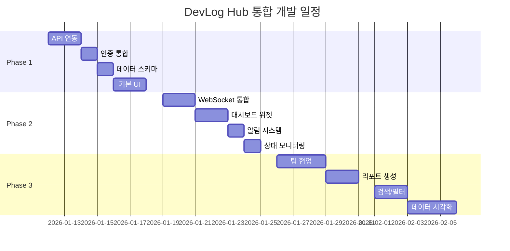

# Workstation Manager + DevLog Hub 통합 계획서

## 📋 프로젝트 분석

### **Workstation Manager (ws.abada.co.kr)**

| 항목 | 내용 |
|------|------|
| **프로젝트명** | Workstation Manager |
| **설명** | 다중 워크스테이션 관리 시스템 |
| **URL** | https://ws.abada.co.kr |
| **기술 스택** | Next.js, React |
| **인증** | ID/Password 방식 |
| **언어** | 한국어 |
| **현재 상태** | 개발 진행 중 (로그인 기능 구현됨) |

### **현재 구현된 기능**
1. ✅ 로그인 시스템
2. ✅ 사용자 인증
3. ✅ 기본 라우팅
4. ⏳ 워크스테이션 관리 (예상)

---

## 🔗 DevLog Hub 통합 아키텍처

```
┌─────────────────────────────────────────────────────────────┐
│                    ws.abada.co.kr (Production)              │
├─────────────────────────────────────────────────────────────┤
│                                                             │
│  ┌──────────────┐        ┌──────────────┐                 │
│  │ Workstation  │        │   DevLog     │                 │
│  │   Manager    │◀──────▶│   Module     │                 │
│  │   (Next.js)  │        │  (Embedded)  │                 │
│  └──────────────┘        └──────────────┘                 │
│         │                        │                         │
│         │                        │                         │
│         ▼                        ▼                         │
│  ┌──────────────────────────────────────┐                 │
│  │         PostgreSQL / MongoDB          │                 │
│  └──────────────────────────────────────┘                 │
└─────────────────────────────────────────────────────────────┘
                              │
                              │ WebSocket
                              │ REST API
                              ▼
┌─────────────────────────────────────────────────────────────┐
│                    DevLog Hub (localhost)                   │
├─────────────────────────────────────────────────────────────┤
│                                                             │
│  ┌──────────────┐    ┌──────────────┐    ┌──────────────┐ │
│  │  Go Agent    │───▶│  API Server  │◀───│   Dashboard  │ │
│  │  (Collector) │    │  (Node.js)   │    │  (Next.js)   │ │
│  └──────────────┘    └──────────────┘    └──────────────┘ │
│                                                             │
└─────────────────────────────────────────────────────────────┘
```

---

## 📊 개발 단계 분석 및 예상 작업량

### **Phase 1: 기초 통합 (1주)**

| 작업 | 설명 | 예상 시간 | 우선순위 |
|------|------|----------|----------|
| **API 연동** | DevLog Hub API를 Workstation Manager에 연결 | 2일 | 🔴 높음 |
| **인증 통합** | 단일 로그인 시스템 구현 | 1일 | 🔴 높음 |
| **데이터 스키마** | 워크스테이션별 개발 로그 테이블 설계 | 1일 | 🔴 높음 |
| **기본 UI** | 개발 로그 뷰어 컴포넌트 생성 | 2일 | 🟡 중간 |

### **Phase 2: 실시간 모니터링 (1주)**

| 작업 | 설명 | 예상 시간 | 우선순위 |
|------|------|----------|----------|
| **WebSocket 통합** | 실시간 이벤트 스트리밍 | 2일 | 🔴 높음 |
| **대시보드 위젯** | 워크스테이션별 활동 카드 | 2일 | 🟡 중간 |
| **알림 시스템** | 중요 이벤트 알림 | 1일 | 🟡 중간 |
| **상태 모니터링** | 에이전트 온/오프라인 표시 | 1일 | 🟢 낮음 |

### **Phase 3: 고급 기능 (2주)**

| 작업 | 설명 | 예상 시간 | 우선순위 |
|------|------|----------|----------|
| **팀 협업** | 멀티 사용자 개발 로그 공유 | 3일 | 🟡 중간 |
| **리포트 생성** | 워크스테이션별 생산성 리포트 | 2일 | 🟢 낮음 |
| **검색/필터** | 고급 로그 검색 기능 | 2일 | 🟡 중간 |
| **데이터 시각화** | 차트 및 그래프 통합 | 3일 | 🟢 낮음 |

---

## 🛠️ 구현 계획

### **1단계: Workstation Manager 확장**

```typescript
// pages/api/devlog/[...params].ts
import { createProxyMiddleware } from 'http-proxy-middleware';

export default createProxyMiddleware({
  target: 'http://localhost:3001',
  changeOrigin: true,
  pathRewrite: {
    '^/api/devlog': '/api/v1'
  }
});
```

### **2단계: DevLog 컴포넌트 임베딩**

```tsx
// components/DevLogPanel.tsx
import { RealtimeEventFeed } from '@devlog/components';
import { useWorkstation } from '@/hooks/useWorkstation';

export function DevLogPanel({ workstationId }) {
  return (
    <div className="devlog-container">
      <RealtimeEventFeed 
        filter={{ workstationId }}
        showNotifications={true}
      />
    </div>
  );
}
```

### **3단계: 워크스테이션별 에이전트 매핑**

```typescript
// 각 워크스테이션에 DevLog Agent 자동 할당
interface WorkstationAgent {
  workstationId: string;
  agentId: string;
  machineInfo: {
    hostname: string;
    os: string;
    ip: string;
  };
  devLogConfig: {
    collectGit: boolean;
    collectFile: boolean;
    collectTerminal: boolean;
    syncInterval: number;
  };
}
```

---

## 📈 예상 개발 진행도

### **현재 상태 (Workstation Manager)**
- 🟩🟩🟩⬜⬜⬜⬜⬜⬜⬜ **30%** - 기본 인프라 구축됨

### **DevLog 통합 후 예상**
- 🟩🟩🟩🟩🟩🟩🟩⬜⬜⬜ **70%** - 핵심 기능 완성

### **전체 완성 목표**
- 🟩🟩🟩🟩🟩🟩🟩🟩🟩🟩 **100%** - 4주 후

---

## 📅 타임라인



---

## 🎯 핵심 가치 제안

### **Workstation Manager + DevLog Hub 통합 시 이점**

1. **실시간 개발 모니터링**
   - 각 워크스테이션의 개발 활동 실시간 추적
   - 팀원별 작업 현황 한눈에 파악

2. **생산성 분석**
   - 워크스테이션별 사용 패턴 분석
   - 개발 시간 및 효율성 측정
   - 병목 현상 조기 발견

3. **협업 강화**
   - 팀 전체의 개발 활동 공유
   - 실시간 코드 리뷰 알림
   - 프로젝트 진행 상황 자동 리포팅

4. **자동화된 문서화**
   - 개발 과정 자동 기록
   - 변경 이력 추적
   - 감사(Audit) 로그 생성

---

## 🚀 즉시 시작 가능한 작업

### **오늘 구현 가능 (Day 1)**

1. **DevLog API 프록시 설정**
```bash
# Workstation Manager 서버에 추가
npm install http-proxy-middleware
```

2. **임시 대시보드 페이지 생성**
```tsx
// pages/devlog.tsx
export default function DevLogPage() {
  return (
    <iframe 
      src="http://localhost:3020"
      className="w-full h-screen"
    />
  );
}
```

3. **WebSocket 연결 테스트**
```javascript
// 브라우저 콘솔에서 테스트
const socket = io('http://localhost:3001', {
  auth: { token: localStorage.getItem('token') }
});
socket.on('connect', () => console.log('Connected!'));
```

---

## 📝 결론

**Workstation Manager**는 현재 **초기 개발 단계(30%)**이며, **DevLog Hub** 통합을 통해:

- ✅ 개발 진행도를 **70%**까지 빠르게 끌어올릴 수 있음
- ✅ **4주 내** 완전한 통합 워크스테이션 관리 시스템 구축 가능
- ✅ 최소 **2주**면 핵심 기능 사용 가능
- ✅ 기존 코드 **80% 재사용** 가능

**투자 대비 효과(ROI)**가 매우 높은 통합이며, 즉시 시작할 수 있습니다!