# DOC-3: DevLog Hub User Flow (사용자 흐름도)

## 1. 개요

### 1.1 문서 목적
Mermaid 다이어그램을 활용하여 주요 사용자 여정을 시각화합니다.

### 1.2 문서 참조
| Doc ID | 참조 내용 |
|--------|----------|
| DOC-1 | USER-1,2,3 페르소나, FEAT-x 기능 정의 |
| DOC-4 | 데이터 흐름의 DB 연결점 |

---

## 2. 시스템 전체 아키텍처 흐름

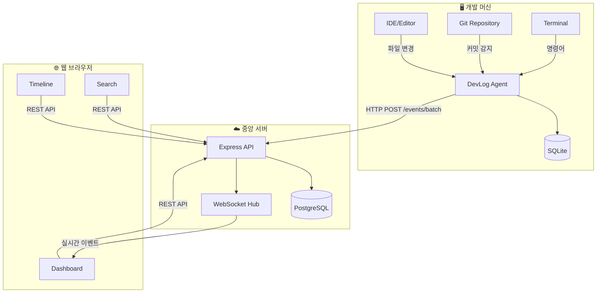

---

## 3. 사용자 여정별 흐름

### 3.1 신규 사용자 온보딩 (USER-1, USER-2, USER-3)

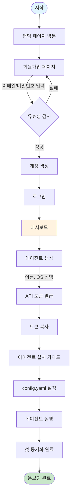

**FEAT 연결**: FEAT-5 (에이전트 관리)

---

### 3.2 일상적 사용 흐름 (USER-1)

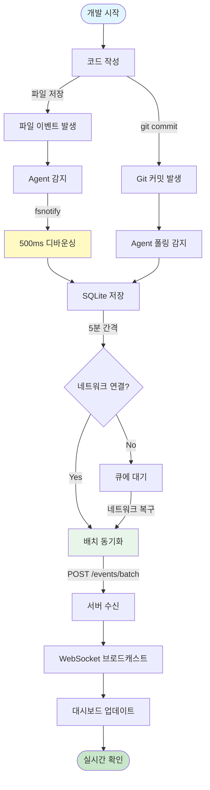

**FEAT 연결**: FEAT-1 (Git), FEAT-2 (파일), FEAT-3 (동기화), FEAT-4 (대시보드)

---

### 3.3 팀 협업 흐름 (USER-2, USER-3)

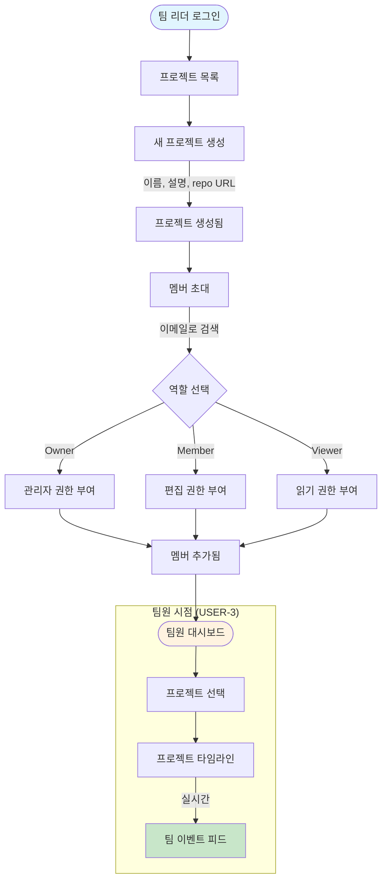

**FEAT 연결**: FEAT-6 (프로젝트 협업)

---

### 3.4 검색 및 필터링 흐름 (USER-1, USER-2, USER-3)

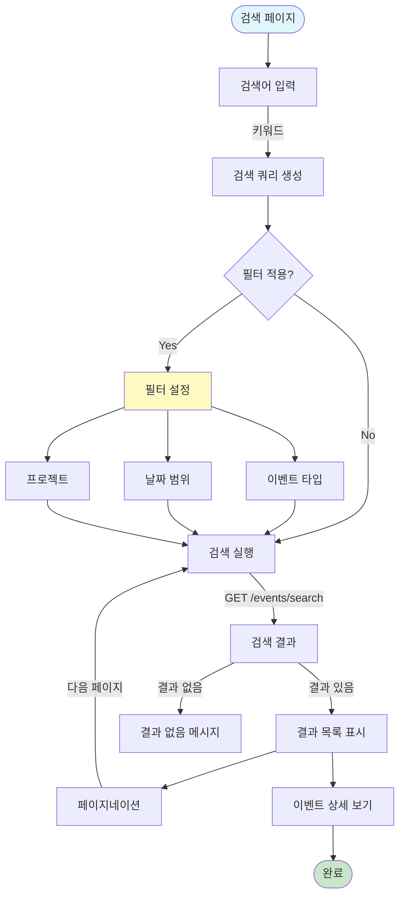

**FEAT 연결**: FEAT-7 (전체 검색)

---

### 3.5 에이전트 관리 흐름 (USER-1, USER-2)

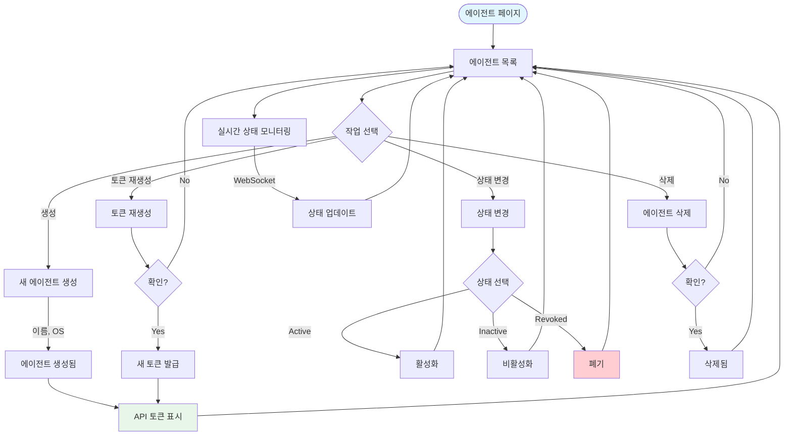

**FEAT 연결**: FEAT-5 (에이전트 관리)

---

## 4. 인증 흐름

### 4.1 사용자 인증 (JWT)

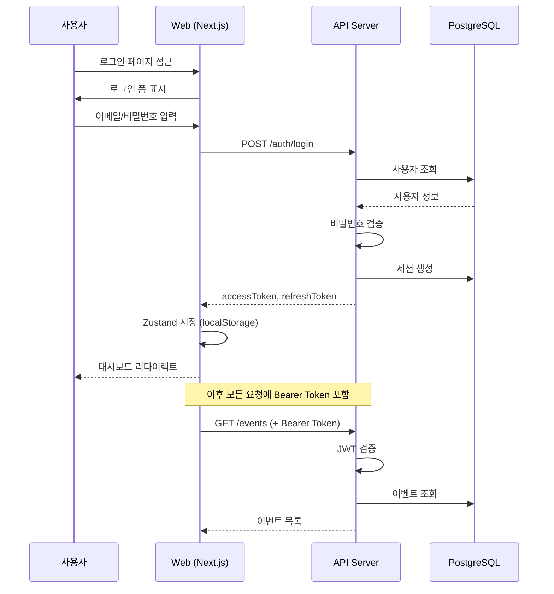

### 4.2 에이전트 인증 (API Token)

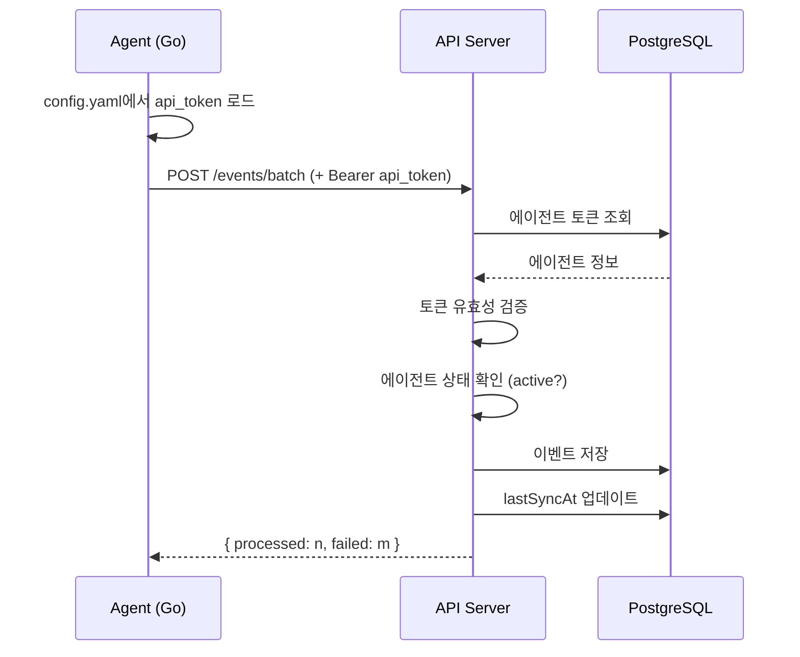

---

## 5. 실시간 통신 흐름

### 5.1 WebSocket 연결 및 이벤트 브로드캐스트

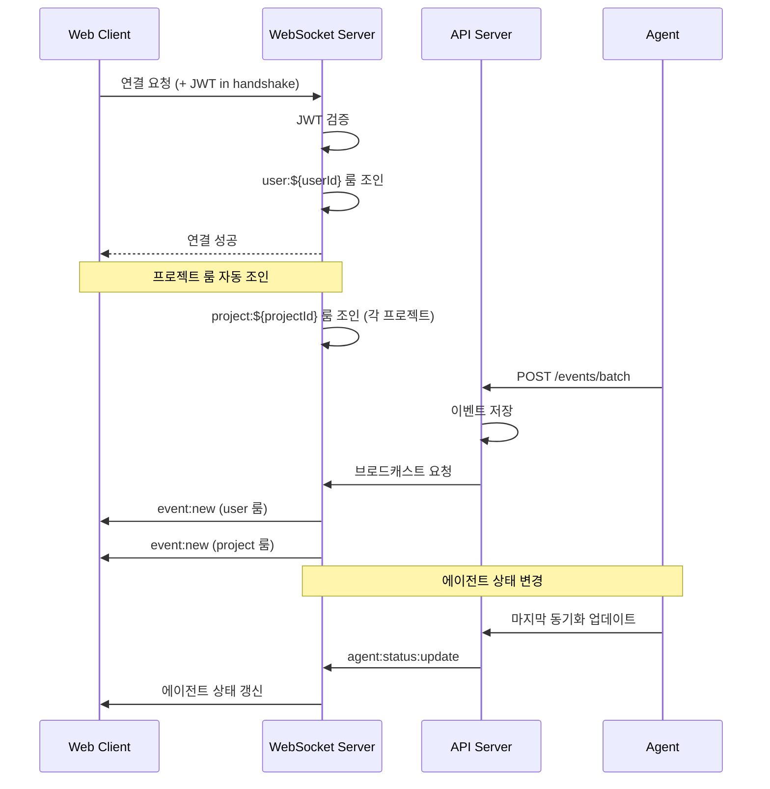

---

## 6. 에러 및 엣지 케이스 흐름

### 6.1 오프라인 동기화 복구

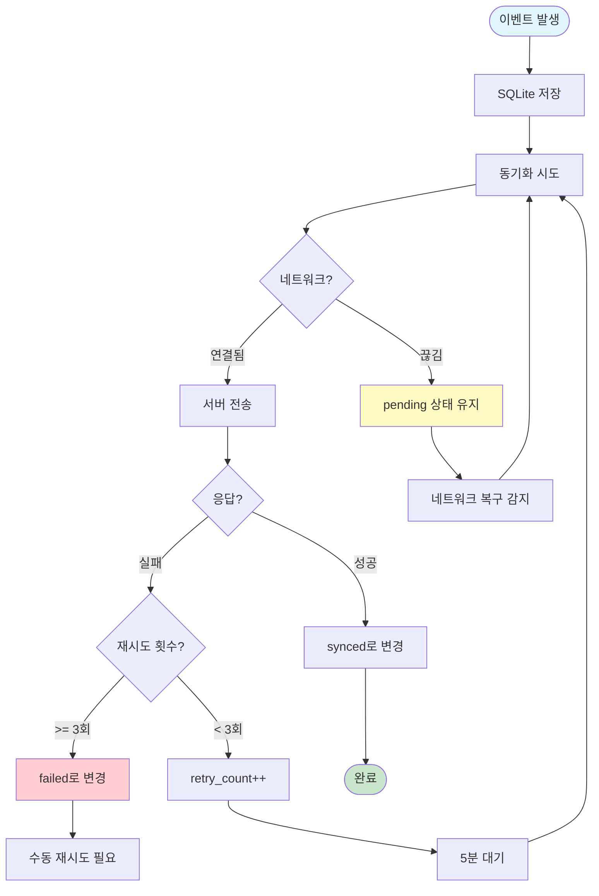

### 6.2 토큰 만료 처리

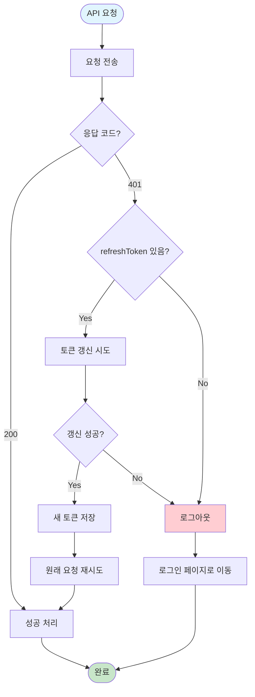

---

## 7. 화면별 상태 다이어그램

### 7.1 대시보드 상태

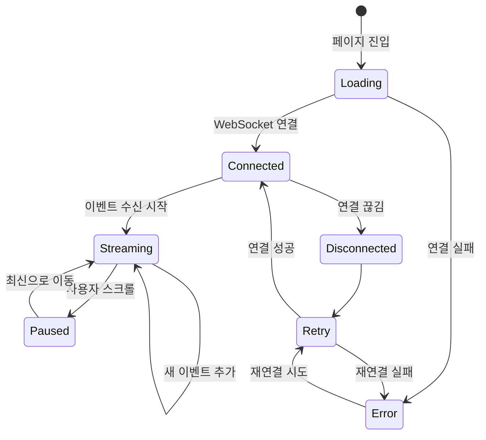

### 7.2 에이전트 상태

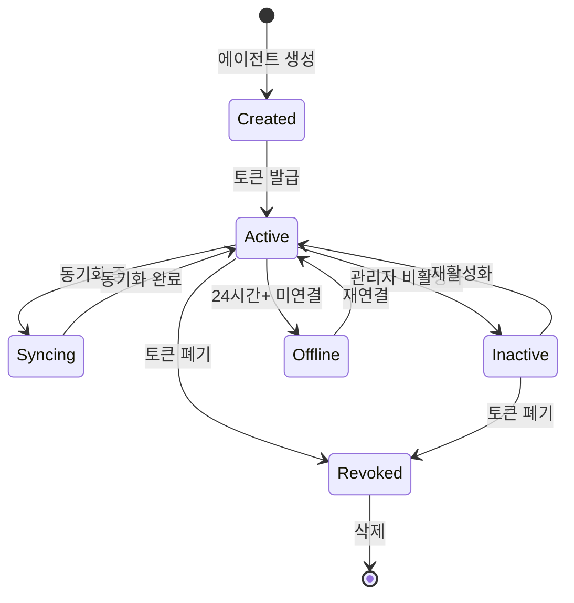

---

## 부록: 화면-기능 매핑

| 화면 | URL | 연결 FEAT | 주요 액션 |
|------|-----|-----------|----------|
| 로그인 | /login | - | 이메일/비밀번호 인증 |
| 회원가입 | /register | - | 계정 생성 |
| 대시보드 | /dashboard | FEAT-4 | 통계, 실시간 피드 |
| 타임라인 | /timeline | FEAT-4 | 전체 이벤트 목록 |
| 에이전트 | /agents | FEAT-5 | 에이전트 CRUD |
| 프로젝트 | /projects | FEAT-6 | 프로젝트/멤버 관리 |
| 검색 | /search | FEAT-7 | 전문 검색, 필터 |
| 노트 | /notes | - | 수동 노트 CRUD |
| 설정 | /settings | - | 프로필, 계정 |
