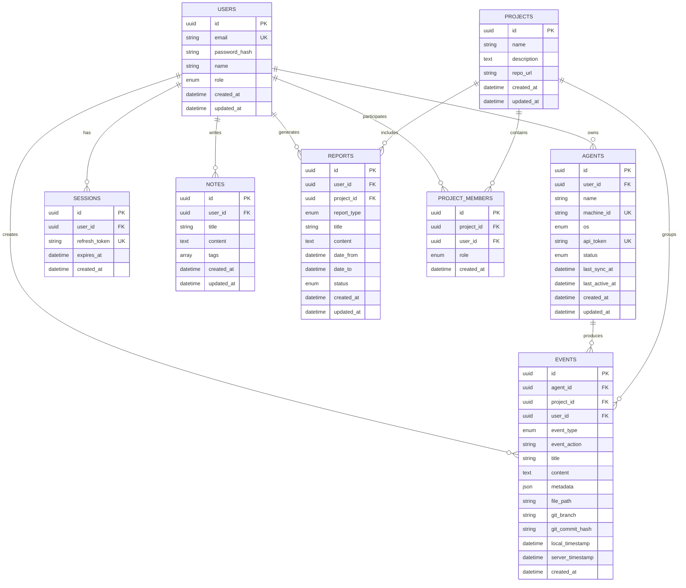
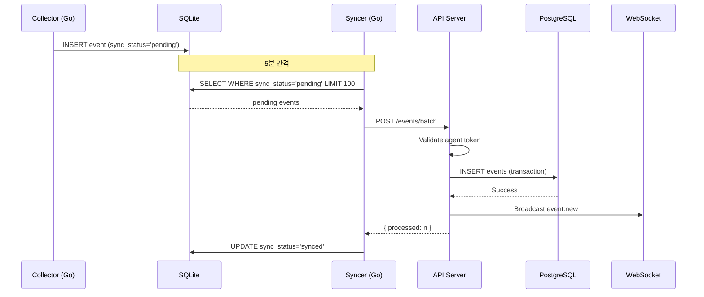

# DOC-4: DevLog Hub Database Design (데이터베이스 설계)

## 1. 개요

### 1.1 문서 목적
DevLog Hub의 데이터 모델, ERD, 인덱싱 전략을 정의합니다.

### 1.2 데이터베이스 구성

| 구성요소 | 데이터베이스 | 용도 |
|----------|-------------|------|
| 중앙 서버 | PostgreSQL 15 | 메인 데이터 저장소 |
| 로컬 에이전트 | SQLite | 오프라인 버퍼 |

### 1.3 문서 참조
| Doc ID | 참조 내용 |
|--------|----------|
| DOC-1 | FEAT-x 기능별 데이터 요구사항 |
| DOC-3 | User Flow의 데이터 흐름 |
| DOC-2 | 기술 스택 및 ORM (Prisma) |

---

## 2. ERD (Entity Relationship Diagram)



---

## 3. 테이블 상세 설계

### 3.1 users (사용자)

**FEAT 연결**: 모든 기능의 기반

| 컬럼 | 타입 | 제약조건 | 설명 |
|------|------|----------|------|
| id | UUID | PK, DEFAULT uuid_generate_v4() | 고유 식별자 |
| email | VARCHAR(255) | UNIQUE, NOT NULL | 로그인 이메일 |
| password_hash | VARCHAR(255) | NOT NULL | bcrypt 해시 |
| name | VARCHAR(100) | NOT NULL | 표시 이름 |
| role | ENUM | DEFAULT 'member' | admin, member, viewer |
| created_at | TIMESTAMP | DEFAULT NOW() | 생성 시각 |
| updated_at | TIMESTAMP | DEFAULT NOW() | 수정 시각 |

```sql
-- Prisma Schema
model User {
  id           String   @id @default(uuid())
  email        String   @unique
  passwordHash String   @map("password_hash")
  name         String
  role         Role     @default(member)
  createdAt    DateTime @default(now()) @map("created_at")
  updatedAt    DateTime @updatedAt @map("updated_at")

  agents         Agent[]
  events         Event[]
  sessions       Session[]
  notes          Note[]
  reports        Report[]
  projectMembers ProjectMember[]

  @@map("users")
}

enum Role {
  admin
  member
  viewer
}
```

---

### 3.2 agents (에이전트)

**FEAT 연결**: FEAT-5 (에이전트 관리), FEAT-3 (동기화)

| 컬럼 | 타입 | 제약조건 | 설명 |
|------|------|----------|------|
| id | UUID | PK | 고유 식별자 |
| user_id | UUID | FK → users.id, NOT NULL | 소유자 |
| name | VARCHAR(100) | NOT NULL | 에이전트 이름 |
| machine_id | VARCHAR(100) | UNIQUE, NOT NULL | 머신 고유 ID |
| os | VARCHAR(20) | NOT NULL | darwin, linux, windows (String으로 저장) |
| api_token | VARCHAR(255) | UNIQUE, NOT NULL | API 인증 토큰 |
| status | ENUM | DEFAULT 'active' | active, inactive, revoked |
| last_sync_at | TIMESTAMP | NULL | 마지막 동기화 시각 |
| last_active_at | TIMESTAMP | NULL | 마지막 활성 시각 |
| created_at | TIMESTAMP | DEFAULT NOW() | 생성 시각 |
| updated_at | TIMESTAMP | DEFAULT NOW() | 수정 시각 |

```sql
-- Prisma Schema
model Agent {
  id           String      @id @default(uuid())
  userId       String      @map("user_id")
  name         String
  machineId    String      @unique @map("machine_id")
  os           Os
  apiToken     String      @unique @map("api_token")
  status       AgentStatus @default(active)
  lastSyncAt   DateTime?   @map("last_sync_at")
  lastActiveAt DateTime?   @map("last_active_at")
  createdAt    DateTime    @default(now()) @map("created_at")
  updatedAt    DateTime    @updatedAt @map("updated_at")

  user   User    @relation(fields: [userId], references: [id], onDelete: Cascade)
  events Event[]

  @@index([userId])
  @@map("agents")
}

enum Os {
  darwin
  linux
  windows
}

enum AgentStatus {
  active
  inactive
  revoked
}
```

---

### 3.3 events (이벤트) - 핵심 테이블

**FEAT 연결**: FEAT-1 (Git), FEAT-2 (파일), FEAT-4 (대시보드), FEAT-7 (검색)

| 컬럼 | 타입 | 제약조건 | 설명 |
|------|------|----------|------|
| id | UUID | PK | 고유 식별자 |
| agent_id | UUID | FK → agents.id, NOT NULL | 발생 에이전트 |
| project_id | UUID | FK → projects.id, NULL | 연결 프로젝트 |
| user_id | UUID | FK → users.id, NOT NULL | 소유자 |
| event_type | ENUM | NOT NULL, INDEX | git, file, terminal, manual |
| event_action | VARCHAR(50) | NOT NULL | commit, create, modify, delete, rename |
| title | VARCHAR(255) | NULL | 이벤트 제목 (선택) |
| content | TEXT | NULL | 상세 내용 |
| metadata | JSONB | NULL | 추가 메타데이터 |
| file_path | VARCHAR(500) | NULL | 파일 경로 (file 타입) |
| git_branch | VARCHAR(100) | NULL | 브랜치 (git 타입) |
| git_commit_hash | VARCHAR(40) | NULL | 커밋 해시 (git 타입) |
| local_timestamp | TIMESTAMP | NOT NULL, INDEX | 로컬 발생 시각 |
| server_timestamp | TIMESTAMP | DEFAULT NOW(), INDEX | 서버 수신 시각 |
| created_at | TIMESTAMP | DEFAULT NOW(), INDEX | 생성 시각 |

```sql
-- Prisma Schema
model Event {
  id              String    @id @default(uuid())
  agentId         String    @map("agent_id")
  projectId       String?   @map("project_id")
  userId          String    @map("user_id")
  eventType       EventType @map("event_type")
  eventAction     String    @map("event_action")
  title           String?
  content         String?
  metadata        Json?
  filePath        String?   @map("file_path")
  gitBranch       String?   @map("git_branch")
  gitCommitHash   String?   @map("git_commit_hash")
  localTimestamp  DateTime  @map("local_timestamp")
  serverTimestamp DateTime  @default(now()) @map("server_timestamp")
  createdAt       DateTime  @default(now()) @map("created_at")

  agent   Agent    @relation(fields: [agentId], references: [id], onDelete: Cascade)
  project Project? @relation(fields: [projectId], references: [id], onDelete: SetNull)
  user    User     @relation(fields: [userId], references: [id], onDelete: Cascade)

  @@index([agentId])
  @@index([userId])
  @@index([eventType])
  @@index([localTimestamp])
  @@index([serverTimestamp])
  @@index([createdAt])
  @@map("events")
}

enum EventType {
  git
  file
  terminal
  manual
}
```

**메타데이터 스키마 (JSONB)**:

```typescript
// Git 이벤트
{
  "author_name": string,
  "author_email": string,
  "repo_path": string,
  "repo_name": string,
  "files_changed": number,
  "insertions": number,
  "deletions": number
}

// 파일 이벤트
{
  "file_size": number,
  "extension": string,
  "directory": string
}

// 터미널 이벤트 (미구현)
{
  "command": string,
  "exit_code": number,
  "working_dir": string
}
```

---

### 3.4 projects (프로젝트)

**FEAT 연결**: FEAT-6 (프로젝트 협업)

| 컬럼 | 타입 | 제약조건 | 설명 |
|------|------|----------|------|
| id | UUID | PK | 고유 식별자 |
| name | VARCHAR(100) | NOT NULL | 프로젝트 이름 |
| description | TEXT | NULL | 설명 |
| repo_url | VARCHAR(500) | NULL | Git 저장소 URL |
| created_at | TIMESTAMP | DEFAULT NOW() | 생성 시각 |
| updated_at | TIMESTAMP | DEFAULT NOW() | 수정 시각 |

```sql
-- Prisma Schema
model Project {
  id          String   @id @default(uuid())
  name        String
  description String?
  repoUrl     String?  @map("repo_url")
  createdAt   DateTime @default(now()) @map("created_at")
  updatedAt   DateTime @updatedAt @map("updated_at")

  members ProjectMember[]
  events  Event[]
  reports Report[]

  @@map("projects")
}
```

---

### 3.5 project_members (프로젝트 멤버)

**FEAT 연결**: FEAT-6 (프로젝트 협업)

| 컬럼 | 타입 | 제약조건 | 설명 |
|------|------|----------|------|
| id | UUID | PK | 고유 식별자 |
| project_id | UUID | FK → projects.id, NOT NULL | 프로젝트 |
| user_id | UUID | FK → users.id, NOT NULL | 사용자 |
| role | ENUM | DEFAULT 'member' | owner, member, viewer |
| created_at | TIMESTAMP | DEFAULT NOW() | 생성 시각 |

```sql
-- Prisma Schema
model ProjectMember {
  id        String      @id @default(uuid())
  projectId String      @map("project_id")
  userId    String      @map("user_id")
  role      ProjectRole @default(member)
  createdAt DateTime    @default(now()) @map("created_at")

  project Project @relation(fields: [projectId], references: [id], onDelete: Cascade)
  user    User    @relation(fields: [userId], references: [id], onDelete: Cascade)

  @@unique([projectId, userId])
  @@map("project_members")
}

enum ProjectRole {
  owner
  member
  viewer
}
```

---

### 3.6 sessions (세션)

| 컬럼 | 타입 | 제약조건 | 설명 |
|------|------|----------|------|
| id | UUID | PK | 고유 식별자 |
| user_id | UUID | FK → users.id, NOT NULL | 사용자 |
| refresh_token | VARCHAR(500) | UNIQUE, NOT NULL, INDEX | 리프레시 토큰 |
| expires_at | TIMESTAMP | NOT NULL, INDEX | 만료 시각 |
| created_at | TIMESTAMP | DEFAULT NOW() | 생성 시각 |

```sql
-- Prisma Schema
model Session {
  id           String   @id @default(uuid())
  userId       String   @map("user_id")
  refreshToken String   @unique @map("refresh_token")
  expiresAt    DateTime @map("expires_at")
  createdAt    DateTime @default(now()) @map("created_at")

  user User @relation(fields: [userId], references: [id], onDelete: Cascade)

  @@index([userId])
  @@index([refreshToken])
  @@index([expiresAt])
  @@map("sessions")
}
```

---

### 3.7 notes (노트)

| 컬럼 | 타입 | 제약조건 | 설명 |
|------|------|----------|------|
| id | UUID | PK | 고유 식별자 |
| user_id | UUID | FK → users.id, NOT NULL | 작성자 |
| title | VARCHAR(255) | NOT NULL | 제목 |
| content | TEXT | NULL | 내용 |
| tags | TEXT[] | DEFAULT '{}' | 태그 배열 |
| created_at | TIMESTAMP | DEFAULT NOW() | 생성 시각 |
| updated_at | TIMESTAMP | DEFAULT NOW() | 수정 시각 |

```sql
-- Prisma Schema
model Note {
  id        String   @id @default(uuid())
  userId    String   @map("user_id")
  title     String
  content   String?
  tags      String[] @default([])
  createdAt DateTime @default(now()) @map("created_at")
  updatedAt DateTime @updatedAt @map("updated_at")

  user User @relation(fields: [userId], references: [id], onDelete: Cascade)

  @@index([userId])
  @@map("notes")
}
```

---

### 3.8 reports (리포트) - 미구현

**FEAT 연결**: FEAT-9 (자동 리포트)

| 컬럼 | 타입 | 제약조건 | 설명 |
|------|------|----------|------|
| id | UUID | PK | 고유 식별자 |
| user_id | UUID | FK → users.id, NOT NULL | 작성자 |
| project_id | UUID | FK → projects.id, NULL | 연결 프로젝트 |
| report_type | ENUM | NOT NULL | daily, weekly, monthly, custom |
| title | VARCHAR(255) | NOT NULL | 제목 |
| content | TEXT | NULL | 내용 |
| date_from | DATE | NOT NULL | 시작일 |
| date_to | DATE | NOT NULL | 종료일 |
| status | ENUM | DEFAULT 'draft' | draft, published |
| created_at | TIMESTAMP | DEFAULT NOW() | 생성 시각 |
| updated_at | TIMESTAMP | DEFAULT NOW() | 수정 시각 |

---

## 4. 로컬 SQLite 스키마 (에이전트)

### 4.1 events (로컬 이벤트 버퍼)

```sql
CREATE TABLE events (
    id TEXT PRIMARY KEY,
    event_type TEXT NOT NULL,
    event_action TEXT NOT NULL,
    title TEXT NOT NULL,
    content TEXT,
    metadata TEXT,  -- JSON string
    file_path TEXT,
    git_branch TEXT,
    git_commit_hash TEXT,
    local_timestamp DATETIME NOT NULL,
    sync_status TEXT DEFAULT 'pending',  -- pending, synced, failed
    retry_count INTEGER DEFAULT 0,
    created_at DATETIME DEFAULT CURRENT_TIMESTAMP
);

CREATE INDEX idx_events_sync_status ON events(sync_status);
CREATE INDEX idx_events_local_timestamp ON events(local_timestamp);
```

---

## 5. 인덱싱 전략

### 5.1 주요 쿼리 패턴 및 인덱스

| 쿼리 패턴 | 인덱스 | 예상 빈도 |
|-----------|--------|----------|
| 사용자별 이벤트 조회 | `events(user_id)` | 매우 높음 |
| 이벤트 타입 필터링 | `events(event_type)` | 높음 |
| 시간 범위 조회 | `events(local_timestamp)`, `events(created_at)` | 높음 |
| 에이전트별 이벤트 | `events(agent_id)` | 중간 |
| 토큰 기반 인증 | `agents(api_token)` | 높음 |
| 세션 검증 | `sessions(refresh_token)` | 높음 |
| 만료 세션 정리 | `sessions(expires_at)` | 낮음 (배치) |

### 5.2 복합 인덱스 권장

```sql
-- 사용자 + 시간 범위 (가장 빈번한 쿼리)
CREATE INDEX idx_events_user_time ON events(user_id, local_timestamp DESC);

-- 사용자 + 타입 + 시간
CREATE INDEX idx_events_user_type_time ON events(user_id, event_type, local_timestamp DESC);

-- 프로젝트 + 시간 (팀 협업 시)
CREATE INDEX idx_events_project_time ON events(project_id, local_timestamp DESC)
WHERE project_id IS NOT NULL;
```

---

## 6. 데이터 흐름

### 6.1 이벤트 생성 흐름



### 6.2 조회 쿼리 흐름


---

## 7. 마이그레이션 전략

### 7.1 Prisma 마이그레이션 명령

```bash
# 스키마 변경 후 마이그레이션 생성
npx prisma migrate dev --name <migration_name>

# 프로덕션 마이그레이션 적용
npx prisma migrate deploy

# 스키마 동기화 (개발용)
npx prisma db push
```

### 7.2 데이터 보존 원칙

| 작업 | 허용 | 금지 |
|------|------|------|
| 컬럼 추가 | NULL 허용 또는 DEFAULT 값 | - |
| 컬럼 삭제 | 사전 데이터 백업 후 | 직접 DROP |
| 타입 변경 | 호환 가능한 타입만 | 데이터 손실 타입 |
| 인덱스 추가 | CONCURRENTLY 사용 | 락 발생 방식 |

---

## 8. 성능 고려사항

### 8.1 파티셔닝 (향후)

```sql
-- 월별 파티셔닝 예시 (대용량 시)
CREATE TABLE events_2026_01 PARTITION OF events
FOR VALUES FROM ('2026-01-01') TO ('2026-02-01');
```

### 8.2 아카이빙 정책

| 데이터 | 보존 기간 | 아카이빙 |
|--------|----------|----------|
| events | 90일 (기본) | Cold Storage 이동 |
| sessions | 만료 후 7일 | 삭제 |
| agents (revoked) | 30일 | 삭제 |

### 8.3 예상 데이터 볼륨

| 시나리오 | 일일 이벤트 | 월간 용량 |
|----------|------------|----------|
| 개인 개발자 | ~500 | ~15MB |
| 5인 팀 | ~2,500 | ~75MB |
| 20인 팀 | ~10,000 | ~300MB |

---

## 부록: 스키마 버전 히스토리

| 버전 | 날짜 | 변경 내용 |
|------|------|----------|
| v1.0 | 2026-01-11 | 초기 스키마 생성 |
