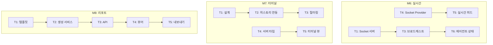

# DOC-6: DevLog Hub TASKS (AI 개발 태스크)

## 1. 개요

### 1.1 문서 목적
AI 코딩 파트너(Claude Code, Cursor 등)가 참조할 마일스톤별 개발 태스크 프롬프트 설계서입니다.

### 1.2 문서 참조
| Doc ID | 참조 내용 |
|--------|----------|
| DOC-1 | FEAT-x 기능 정의, 인수 조건 |
| DOC-2 | 기술 스택, 아키텍처 |
| DOC-4 | 데이터베이스 스키마 |
| DOC-7 | 코딩 컨벤션 |

### 1.3 상태 범례

| 상태 | 설명 |
|------|------|
| ✅ 완료 | 구현 완료, 테스트 통과 |
| 🔄 진행중 | 현재 작업 중 |
| 🔲 예정 | 미착수 |
| ⏸️ 보류 | 의존성 또는 결정 대기 |

---

## 2. 마일스톤 개요

```mermaid
gantt
    title DevLog Hub 마일스톤
    dateFormat  YYYY-MM-DD
    section Phase 1
    M0: 프로젝트 초기화     :done, m0, 2026-01-10, 1d
    M1: 백엔드 기반         :done, m1, after m0, 2d
    M2: Go 에이전트         :done, m2, after m1, 2d
    M3: 웹 대시보드         :done, m3, after m2, 2d
    M4: 통합 및 테스트      :done, m4, after m3, 1d
    M5: 배포 준비           :done, m5, after m4, 1d
    section Phase 2
    M6: 실시간 기능         :active, m6, after m5, 2d
    M7: 터미널 추적         :m7, after m6, 2d
    M8: 리포트 생성         :m8, after m7, 2d
```

---

## 3. Phase 1: MVP (완료)

### M0: 프로젝트 초기화 ✅

#### 목표
모노레포 구조 설정, 개발 환경 구성

#### 태스크

| ID | 태스크 | FEAT | 상태 |
|----|--------|------|------|
| M0-T1 | 루트 디렉토리 구조 생성 | - | ✅ |
| M0-T2 | server/ 초기화 (npm init, TypeScript) | - | ✅ |
| M0-T3 | web/ 초기화 (create-next-app) | - | ✅ |
| M0-T4 | agent/ 초기화 (go mod init) | - | ✅ |
| M0-T5 | Docker Compose 설정 | - | ✅ |
| M0-T6 | 공통 스크립트 작성 (setup.sh, dev.sh) | - | ✅ |

#### AI 프롬프트 (참조용)

```
M0-T1: 다음 구조로 모노레포를 초기화해주세요:
- /server (Node.js Express API)
- /web (Next.js 14 App Router)
- /agent (Go 에이전트)
- /docs (문서)
- /scripts (유틸리티 스크립트)

루트에 README.md와 .gitignore를 생성하고,
각 서브 프로젝트에 적절한 .gitignore를 추가해주세요.
```

---

### M1: 백엔드 기반 ✅

#### 목표
Express API 서버, Prisma 설정, 인증 시스템 구현

#### 태스크

| ID | 태스크 | FEAT | 상태 |
|----|--------|------|------|
| M1-T1 | Express 서버 초기화, 미들웨어 설정 | - | ✅ |
| M1-T2 | Prisma 스키마 정의 (DOC-4 참조) | - | ✅ |
| M1-T3 | 인증 API (/auth/*) 구현 | - | ✅ |
| M1-T4 | 에이전트 API (/agents/*) 구현 | FEAT-5 | ✅ |
| M1-T5 | 이벤트 API (/events/*) 구현 | FEAT-1,2 | ✅ |
| M1-T6 | 프로젝트 API (/projects/*) 구현 | FEAT-6 | ✅ |
| M1-T7 | 노트 API (/notes/*) 구현 | - | ✅ |

#### AI 프롬프트 (참조용)

```
M1-T3: Express에서 JWT 기반 인증 시스템을 구현해주세요.

요구사항:
1. POST /api/v1/auth/register - 회원가입
   - 입력: email, password, name
   - bcrypt로 비밀번호 해싱
   - Zod로 입력 검증

2. POST /api/v1/auth/login - 로그인
   - accessToken (15분), refreshToken (24시간) 발급
   - 세션을 DB에 저장

3. POST /api/v1/auth/refresh - 토큰 갱신
   - refreshToken 검증 후 새 accessToken 발급

4. POST /api/v1/auth/logout - 로그아웃
   - DB에서 세션 삭제

5. GET /api/v1/auth/profile - 프로필 조회
   - JWT 미들웨어로 보호

기술 스택: Express, Prisma, jsonwebtoken, bcryptjs, zod
```

---

### M2: Go 에이전트 ✅

#### 목표
Git 수집기, 파일 수집기, 로컬 저장소, 서버 동기화 구현

#### 태스크

| ID | 태스크 | FEAT | 상태 |
|----|--------|------|------|
| M2-T1 | 프로젝트 구조 설정, main.go | - | ✅ |
| M2-T2 | YAML 설정 파서 구현 | - | ✅ |
| M2-T3 | SQLite 스토리지 레이어 구현 | FEAT-3 | ✅ |
| M2-T4 | Git 커밋 수집기 구현 | FEAT-1 | ✅ |
| M2-T5 | 파일 변경 수집기 구현 | FEAT-2 | ✅ |
| M2-T6 | 서버 동기화 엔진 구현 | FEAT-3 | ✅ |

#### AI 프롬프트 (참조용)

```
M2-T4: Go로 Git 커밋 수집기를 구현해주세요.

요구사항:
1. 설정된 watch_dirs를 순회하며 .git 디렉토리 탐색
2. go-git 라이브러리로 최근 커밋 조회
3. 마지막 수집 이후의 새 커밋만 추출
4. 수집 데이터:
   - commit hash, author name, author email
   - commit message, branch name
   - repo path, repo name
5. 30초 간격 폴링
6. 수집된 이벤트를 SQLite에 저장

참조 파일:
- internal/config/config.go (설정 구조체)
- internal/storage/sqlite.go (저장소 인터페이스)
```

---

### M3: 웹 대시보드 ✅

#### 목표
Next.js 대시보드, 인증 UI, 실시간 이벤트 피드 구현

#### 태스크

| ID | 태스크 | FEAT | 상태 |
|----|--------|------|------|
| M3-T1 | Next.js 프로젝트 설정, Tailwind | - | ✅ |
| M3-T2 | 인증 페이지 (로그인, 회원가입) | - | ✅ |
| M3-T3 | Zustand 인증 스토어 | - | ✅ |
| M3-T4 | 대시보드 레이아웃, 사이드바 | - | ✅ |
| M3-T5 | 대시보드 메인 페이지 | FEAT-4 | ✅ |
| M3-T6 | 에이전트 관리 페이지 | FEAT-5 | ✅ |
| M3-T7 | 프로젝트 관리 페이지 | FEAT-6 | ✅ |
| M3-T8 | 검색 페이지 | FEAT-7 | ✅ |
| M3-T9 | API 서비스 레이어 | - | ✅ |

#### AI 프롬프트 (참조용)

```
M3-T5: Next.js 14로 대시보드 메인 페이지를 구현해주세요.

요구사항:
1. 통계 카드 그리드 (4열)
   - 총 이벤트 수 (7일), Git 활동, 파일 변경, 수동 노트
   - 아이콘 + 숫자 + 라벨

2. 최근 활동 타임라인
   - 이벤트 타입별 아이콘 (git: orange, file: violet)
   - 제목, 시간, 에이전트 표시
   - 무한 스크롤 또는 페이지네이션

3. 일별 활동 차트 (옵션)
   - 막대 차트 또는 라인 차트

4. React Query로 데이터 페칭
5. 로딩, 에러 상태 처리

디자인 참조: DOC-5 Design System
API 참조: GET /api/v1/events, GET /api/v1/events/stats
```

---

### M4: 통합 및 테스트 ✅

#### 목표
전체 시스템 통합, E2E 테스트, 버그 수정

#### 태스크

| ID | 태스크 | FEAT | 상태 |
|----|--------|------|------|
| M4-T1 | Docker Compose 전체 서비스 테스트 | - | ✅ |
| M4-T2 | 에이전트 → 서버 동기화 테스트 | FEAT-3 | ✅ |
| M4-T3 | 서버 → 웹 실시간 이벤트 테스트 | FEAT-4 | ✅ |
| M4-T4 | 인증 플로우 E2E 테스트 | - | ✅ |
| M4-T5 | 버그 수정 및 안정화 | - | ✅ |

---

### M5: 배포 준비 ✅

#### 목표
문서화, Git 커밋, 릴리즈 준비

#### 태스크

| ID | 태스크 | FEAT | 상태 |
|----|--------|------|------|
| M5-T1 | README.md 작성 | - | ✅ |
| M5-T2 | CLAUDE.md 작성 | - | ✅ |
| M5-T3 | 개발 로그 작성 (KO/EN) | - | ✅ |
| M5-T4 | Git 커밋 및 푸시 | - | ✅ |

---

## 4. Phase 2: 확장 기능 (진행중/예정)

### M6: 실시간 기능 강화 🔄

#### 목표
WebSocket 완전 통합, 실시간 알림, 에이전트 상태 모니터링

#### 태스크

| ID | 태스크 | FEAT | 상태 | 의존성 |
|----|--------|------|------|--------|
| M6-T1 | Socket.io 서버 설정 완료 | FEAT-4 | ✅ | - |
| M6-T2 | WebSocket 인증 미들웨어 | FEAT-4 | ✅ | - |
| M6-T3 | 이벤트 브로드캐스트 구현 | FEAT-4 | ✅ | M6-T1 |
| M6-T4 | 클라이언트 Socket Provider | FEAT-4 | ✅ | - |
| M6-T5 | 실시간 이벤트 피드 UI | FEAT-4 | 🔄 | M6-T4 |
| M6-T6 | 에이전트 상태 실시간 표시 | FEAT-5 | 🔄 | M6-T3 |
| M6-T7 | Toast 알림 시스템 | FEAT-4 | 🔲 | M6-T4 |

#### AI 프롬프트

```
M6-T5: 대시보드에 실시간 이벤트 피드를 구현해주세요.

요구사항:
1. SocketProvider에서 'event:new' 이벤트 구독
2. 새 이벤트 수신 시 타임라인 상단에 추가
3. 애니메이션 효과로 새 이벤트 강조
4. 스크롤 중일 때는 "새 이벤트 보기" 버튼 표시
5. 이벤트 타입별 색상 구분

참조 파일:
- web/src/components/providers/SocketProvider.tsx
- web/src/hooks/useSocket.ts
- DOC-5 Design System (이벤트 타입 색상)
```

---

### M7: 터미널 명령 추적 🔲

#### 목표
FEAT-8 구현 - 셸 명령어 자동 수집

#### 태스크

| ID | 태스크 | FEAT | 상태 | 의존성 |
|----|--------|------|------|--------|
| M7-T1 | 터미널 수집기 설계 | FEAT-8 | 🔲 | - |
| M7-T2 | bash/zsh 히스토리 연동 | FEAT-8 | 🔲 | M7-T1 |
| M7-T3 | 민감 명령어 필터링 | FEAT-8 | 🔲 | M7-T2 |
| M7-T4 | 서버 이벤트 타입 추가 | FEAT-8 | 🔲 | - |
| M7-T5 | 대시보드 터미널 뷰 | FEAT-8 | 🔲 | M7-T4 |

#### AI 프롬프트

```
M7-T1: Go 에이전트에 터미널 명령 수집기를 설계해주세요.

요구사항:
1. 수집 방식 선택:
   - Option A: 셸 히스토리 파일 감시 (~/.bash_history, ~/.zsh_history)
   - Option B: 셸 hook 스크립트 제공

2. 수집 데이터:
   - command (실행 명령)
   - working_directory (실행 위치)
   - exit_code (종료 코드, 가능한 경우)
   - timestamp (실행 시각)

3. 보안 고려사항:
   - 비밀번호, API 키 등 민감 정보 필터링
   - 필터 패턴: password, token, secret, key, auth

4. 설정 항목:
   - enabled: true/false
   - history_file: 경로 지정
   - filter_patterns: 제외할 패턴 목록

설계 문서를 먼저 작성하고, 구현 계획을 제시해주세요.
```

---

### M8: 리포트 생성 🔲

#### 목표
FEAT-9 구현 - 자동 활동 리포트 생성

#### 태스크

| ID | 태스크 | FEAT | 상태 | 의존성 |
|----|--------|------|------|--------|
| M8-T1 | 리포트 템플릿 설계 | FEAT-9 | 🔲 | - |
| M8-T2 | 리포트 생성 서비스 | FEAT-9 | 🔲 | M8-T1 |
| M8-T3 | 리포트 API (/reports/*) | FEAT-9 | 🔲 | M8-T2 |
| M8-T4 | 리포트 뷰어 UI | FEAT-9 | 🔲 | M8-T3 |
| M8-T5 | PDF/Markdown 내보내기 | FEAT-9 | 🔲 | M8-T4 |
| M8-T6 | 자동 생성 스케줄러 | FEAT-9 | 🔲 | M8-T2 |

#### AI 프롬프트

```
M8-T1: 개발 활동 리포트 템플릿을 설계해주세요.

요구사항:
1. 리포트 타입:
   - daily: 일일 리포트
   - weekly: 주간 리포트 (월~일)
   - monthly: 월간 리포트
   - custom: 사용자 지정 기간

2. 리포트 섹션:
   - 요약 (총 이벤트, 활동 시간, 주요 성과)
   - Git 활동 (커밋 수, 주요 커밋 목록)
   - 파일 작업 (생성/수정/삭제 통계)
   - 프로젝트별 분류
   - 시간대별 활동 그래프

3. 출력 형식:
   - 웹 뷰어 (HTML/React)
   - Markdown 내보내기
   - PDF 내보내기

템플릿 구조를 JSON Schema로 정의해주세요.
```

---

## 5. Phase 3: 고급 기능 (계획)

### M9: AI 인사이트 🔲

| ID | 태스크 | 설명 |
|----|--------|------|
| M9-T1 | 코딩 패턴 분석 | 활동 데이터 기반 생산성 분석 |
| M9-T2 | 이상 탐지 | 비정상 활동 패턴 알림 |
| M9-T3 | 추천 시스템 | 최적 작업 시간대 추천 |

### M10: IDE 플러그인 🔲

| ID | 태스크 | 설명 |
|----|--------|------|
| M10-T1 | VS Code 확장 | 직접 이벤트 수집 |
| M10-T2 | JetBrains 플러그인 | IntelliJ 계열 지원 |

### M11: 팀 기능 확장 🔲

| ID | 태스크 | 설명 |
|----|--------|------|
| M11-T1 | 팀 대시보드 | 팀 전체 활동 뷰 |
| M11-T2 | 권한 관리 | 세분화된 접근 제어 |
| M11-T3 | SSO 연동 | Google, GitHub OAuth |

---

## 6. 태스크 작성 가이드

### 6.1 AI 프롬프트 작성 원칙

1. **컨텍스트 제공**: 관련 문서(DOC-x), 파일 경로 명시
2. **명확한 요구사항**: 번호 목록으로 구체적 기능 나열
3. **기술 제약**: 사용할 기술 스택, 버전 명시
4. **인수 조건**: 완료 기준 명확히 정의
5. **참조 코드**: 기존 코드 패턴이 있다면 경로 제공

### 6.2 프롬프트 템플릿

```markdown
## [Task ID]: [Task 제목]

### 목표
[1-2문장으로 목표 설명]

### 요구사항
1. [구체적 기능 1]
2. [구체적 기능 2]
3. ...

### 기술 제약
- 프레임워크: [X]
- 라이브러리: [Y, Z]
- 스타일: DOC-7 코딩 컨벤션 준수

### 참조
- 파일: [경로1], [경로2]
- 문서: [DOC-x]
- API: [엔드포인트]

### 인수 조건
- [ ] [체크포인트 1]
- [ ] [체크포인트 2]
```

### 6.3 의존성 관리



---

## 부록: 체크리스트

### Phase 1 완료 체크

- [x] M0: 프로젝트 구조 완성
- [x] M1: 모든 API 엔드포인트 동작
- [x] M2: 에이전트 Git/File 수집 동작
- [x] M3: 대시보드 모든 페이지 렌더링
- [x] M4: 전체 흐름 E2E 검증
- [x] M5: 문서화 및 커밋 완료

### Phase 2 진행 체크

- [x] M6-T1~T4: WebSocket 기반 구축
- [ ] M6-T5~T7: 실시간 UI 완성
- [ ] M7: 터미널 추적 (미착수)
- [ ] M8: 리포트 생성 (미착수)
